# 🎯 Flux Life Assistant

*"Transforming Goals into Daily Actions with Empathetic AI"*


---

## About the Project

Most people fail at their goals not because they lack motivation, but because they struggle to bridge the **Goal-to-Action Gap** — the disconnect between setting an ambitious target and knowing exactly what to do today, tomorrow, and next week to achieve it. Traditional productivity tools track tasks but don't understand context, adapt to disruptions, or offer encouragement when plans fall apart.

**Flux** is an AI-powered life assistant that closes this gap. Through natural conversation, Flux decomposes high-level goals (like "lose 15 lbs before my wedding") into personalized daily schedules with concrete, time-blocked actions. It monitors progress in real time, detects when tasks drift, and proactively reschedules your day — all while maintaining an empathetic, supportive tone.

What sets Flux apart is its **Compassionate Drift & Shuffle** engine. Instead of punishing missed tasks with guilt or rigid failure states, Flux intelligently redistributes your schedule, factors in your energy levels and priorities, and sends encouraging nudges to get you back on track. Life happens — Flux adapts with you.

> 📹 **Demo Video:** [Coming Soon](#)

### Who is Flux for?

**Goal-Setters** — Individuals with aspirations who struggle to create and maintain actionable plans. Flux turns ambiguous intentions into concrete daily steps and keeps you accountable without pressure.

**Busy Professionals** — Knowledge workers juggling multiple responsibilities who need intelligent prioritization. Flux auto-resolves scheduling conflicts and surfaces only what matters right now.

**Neurodivergent Users** — People with ADHD or executive dysfunction who benefit from adaptive, shame-free task management. Flux never punishes a missed task — it adapts the plan and meets you where you are.

**Lifestyle Optimizers** — Anyone seeking a personal AI assistant that understands their patterns and adapts. Flux learns your rhythms over time and schedules around your energy, not just your calendar.

---

## Features

**Empathetic Goal Breakdown** — An AI dialogue that understands your "why" before creating a plan. Flux asks the right questions to build a schedule rooted in your personal motivation, not generic templates. Goals are decomposed through multi-turn conversation into weekly milestones with concrete recurring tasks.

**Context-Aware Reminders** — Smart notifications that factor in location, time of day, and behavior patterns. Flux knows when you're most productive and when a gentle nudge is more effective than an alarm. On-device sensors detect context like "just left work" to trigger relevant reminders at the right moment.

**Compassionate Drift & Shuffle** — Missed a task? Flux reschedules with encouragement, not guilt. The drift engine evaluates what can shift, what's critical, and how to keep your day balanced. Instead of a red "overdue" label, you get a negotiation: "Gym drifted — I can fit it at 5 PM or tomorrow at 7 AM."

**Multi-Channel Escalation** — Push notification → SMS → WhatsApp, escalating based on task priority and response history. Critical tasks don't get lost in notification noise. Must-not-miss items can escalate all the way to a VoIP call as a final safety net.

**Pattern Learning** — Over time, Flux learns your productive hours, preferred routines, and common disruption patterns to build increasingly accurate schedules. The Observer agent detects aversions (like consistently skipping Monday gym sessions) and suggests preference updates weekly.

**Demo Mode** — Time-warp controls and scenario simulation tools for showcasing the full lifecycle — goal creation, drift detection, recovery — in minutes instead of weeks. Pre-seeded data lets anyone experience Flux's failure-handling flows without waiting for real time to pass.

**Voice-First Interaction** — Speak naturally to create tasks, set goals, and manage your schedule. Flux uses Speech-to-Text and Text-to-Speech for a conversational experience that reduces form-filling friction.

---

## Why Flux?

| Competitor | Their Approach | Where They Fall Short |
|------------|----------------|----------------------|
| **Todoist** | Task lists with due dates and manual rescheduling | No understanding of *why* you missed; pure list management |
| **Reclaim.ai** | Auto-schedules around calendar meetings | Rigid time slots; no emotional intelligence; no pattern learning |
| **Motion** | AI auto-scheduler for teams | Enterprise-focused; no compassion layer; expensive |
| **Notion Calendar** | Unified workspace with drag-and-drop | Manual effort; no AI intervention when plans fail |
| **Google Calendar** | Universal calendar standard | Binary missed/done states; red "overdue" labels trigger shame |

**Flux fills the gap** with goal decomposition, context-aware nudging, compassionate rescheduling, and multi-channel escalation — capabilities none of the above offer together.

---

## Tech Stack

| Layer | Technology |
|-------|-----------|
| Frontend | React 19, TanStack Start, Vite 7, TypeScript, Framer Motion, Tailwind CSS |
| Backend | FastAPI, Python 3.11+ |
| Database | PostgreSQL via Supabase |
| AI/ML | GPT-4o-mini (OpenRouter), RAG (Pinecone) |
| Deployment | Vercel (Frontend), Railway/Render (Backend) |

---

## Architecture

```mermaid
flowchart TD
    subgraph Client
        User["👤 User / PWA"]
    end

    subgraph Frontend
        FE["⚛️ React Frontend<br/>Vite + TypeScript + Framer Motion"]
    end

    subgraph Backend["FastAPI Backend"]
        API["🔌 API Gateway"]

        subgraph Agents["AI Agent Layer"]
            GP["🎯 Goal Planner<br/>Goal Breakdown & Plans"]
            SC["🗓️ Scheduler<br/>Core Orchestrator"]
            OB["🔍 Observer<br/>Pattern Learning"]
            SN["📍 Sensor<br/>Context Awareness"]
            EM["💚 Empath<br/>Sentiment Detection"]
        end

        LLM["🧠 GPT-4o-mini<br/>NL Understanding + Tool Use"]
    end

    subgraph Data
        DB[("🗄️ PostgreSQL<br/>Supabase")]
        RAG["📚 Vector DB<br/>Pinecone/Chroma"]
    end

    subgraph Notifications
        N["🔔 Notification Service"]
        Push["📱 Push"]
        WA["📲 WhatsApp"]
        Call["📞 VoIP Call"]
    end

    User --> FE
    FE --> API
    API --> GP
    API --> SC
    GP -->|"Structured plan"| SC
    OB -->|"User patterns"| SC
    SN -->|"Current context"| SC
    EM -->|"Emotional state"| SC
    SC <-->|"NL + Tool Calling"| LLM
    GP <--> LLM
    SC --> DB
    SC --> RAG
    SC --> N
    N --> Push
    N --> WA
    N --> Call
```



Flux uses a **multi-agent architecture**. The **Goal Planner** (implemented) decomposes user goals into weekly milestones and daily tasks through empathetic dialogue. The **Scheduler** (implemented) is the core orchestrator — time-blocking, conflict resolution, drift recovery, and reschedule suggestions (GET /scheduler/tasks, POST /scheduler/suggest, POST /scheduler/apply). Observer, Sensor, and Empath are planned; the diagram shows the target architecture. Implemented agents use GPT-4o-mini (OpenRouter) and an optional RAG pipeline (Pinecone) for context.

---

## AI Agents

| Agent | Purpose | Key Behavior |
|-------|---------|-------------|
| 🎯 **Goal Planner** | Transforms vague goals into structured plans | Multi-turn empathetic dialogue; weekly milestones; recurring task creation (POST /goals/start, POST /goals/{id}/respond) |
| 🗓️ **Scheduler** | Core orchestrator for calendar and drift recovery | Timeline tasks (GET /scheduler/tasks); reschedule suggestions (POST /scheduler/suggest); apply or skip (POST /scheduler/apply) |
| 🔍 **Observer** | *(Planned)* Learns user behavior patterns over time | Detects aversions; suggests preference updates weekly |
| 📍 **Sensor** | *(Planned)* Infers real-time context from device signals | GPS, phone state; adjusts nudge timing; on-device |
| 💚 **Empath** | *(Planned)* Gauges emotional state from voice input | Tone and urgency modulation |

---

## Getting Started

### Prerequisites

- **Node.js 18+** — [Install](https://nodejs.org)
- **Python 3.11+** — [Install](https://python.org)
- **Docker Desktop** — [Install for Mac](https://docs.docker.com/desktop/install/mac-install/) (must be running)
- **Supabase CLI** — Install via Homebrew:
  ```bash
  brew install supabase/tap/supabase
  ```

### Quick Start (Recommended)

See **[Getting Started](docs/getting-started.md)** for full steps. Summary:

```bash
git clone https://github.com/MacDavicK/Flux-Team-8.git
cd Flux-Team-8

# 1. Install frontend & backend dependencies
bash scripts/setup.sh

# 2. Set up Supabase (Docker Desktop must be running)
bash scripts/supabase_setup.sh
```

After setup:

```bash
# Terminal 1 — Frontend
cd frontend && npm run dev

# Terminal 2 — Backend
cd backend && source venv/bin/activate && uvicorn app.main:app --reload
```

Frontend: [http://localhost:5173](http://localhost:5173). Backend: [http://localhost:8000](http://localhost:8000). API docs: [http://localhost:8000/docs](http://localhost:8000/docs).

### Connecting Frontend to Backend

- **Mock mode (`VITE_USE_MOCK=true`):** Frontend uses mock data; no backend required.
- **Live backend (`VITE_USE_MOCK=false`):** Frontend calls `VITE_API_URL` for timeline and reschedule. Set in `frontend/.env` and restart `npm run dev`.

### Feature Flags

`VITE_USE_MOCK`, `VITE_ENABLE_VOICE`, `VITE_ENABLE_DEMO_MODE` — see [Feature Flags](docs/feature-flags.md).

Manual installation, Supabase URLs, and seed commands: **[Getting Started](docs/getting-started.md)**.

---

## Project Structure

The main backend app lives under `backend/app/` (agents, routers, services, models). Frontend is TanStack Start under `frontend/src/`. Full tree: **[Project Structure](docs/project-structure.md)**.

---

## Development Workflow

- **Branches:** `feature/<name>`, `bugfix/<name>`, `hotfix/<name>`
- **Commits:** Conventional Commits (`feat:`, `fix:`, `docs:`, `chore:`)
- **PRs:** Require 1 review, must pass linting and type-check
- **Testing:** Unit tests for utilities, integration tests for API layer

---

## Roadmap

- [x] Week 1: Foundation — Project setup, routing, mock API (Feb 10–16)
- [ ] Week 2: Core Features — Calendar view, goal chat, task management (Feb 17–23)
- [ ] Week 3: AI Agents — Planner, scheduler, nudge agents (Feb 24–Mar 2)
- [ ] Week 4: Polish & Demo — Animations, edge cases, demo mode (Mar 3–9)

---

## Scope

| Capability | v1 (MVP Demo) | v2 (Post-Launch) |
|-----------|---------------|-----------------|
| **Goal Categories** | Health & Fitness only | Career, Personal, Finance, Learning, Relationships |
| **Goal Timeline** | Up to 6 months | Multi-year with quarterly reviews |
| **Plan Depth** | High-level weekly milestones | Deep plans (calories, specific workouts, curricula) |
| **Calendar Sync** | Internal Flux calendar only | Google Calendar two-way sync |
| **Pattern Learning** | Hard-coded demo scenarios | Lightweight RL model tracking accept/reject/miss rates |
| **Context Awareness** | Simulated via demo controls | On-device ML (TensorFlow Lite) for location and phone state |
| **Sentiment Detection** | Keyword-based tone adjustment | On-device speech emotion recognition |
| **Cold Storage** | Static parking lot view | Full chronic-avoidance detection with weekly review prompts |
| **Notification Channels** | Push + 1 WhatsApp + 1 call path | Email, rich WhatsApp quick replies, full VoIP |
| **External Integrations** | None | Apple Health, Fitbit, Strava, MyFitnessPal |

---

## Guardrails

**Tone Safety** — Flux never uses shaming language. If a task is missed, responses use neutral or supportive phrasing: *"Let's find a better time"* rather than *"You failed again."*

**Privacy by Design** — Context awareness (location, phone state) uses on-device processing only. No location data leaves the device. Voice interactions produce transcripts and emotion labels — raw audio is never stored.

**Explainability** — When suggesting a new time slot, Flux displays a brief rationale: *"Suggested 6 PM because you prefer evening workouts and 5 PM was blocked."*

**Consent & Control** — All sensor-based features require explicit opt-in with granular permissions. Users can disable any data signal at any time; the AI falls back to time-based heuristics.

---

## Demo Day

- **Date:** Early March 2026
- **Duration:** 15–20 minutes
- **Key flows:** Goal creation → schedule generation → drift handling → recovery

---

## Demo Mode

Time-warp, force-miss, and escalation controls for showcasing drift and recovery. Pre-seeded data and sample flow: **[Demo Mode](docs/demo-mode.md)**.

## Notification Escalation

Push → WhatsApp → call by priority (standard, important, must-not-miss). Speed multiplier for demos. Details: **[Notification Escalation](docs/notification-escalation.md)** and SCRUM 40–44 READMEs in `backend/`.

---

## Database Schema

Tables: `users`, `goals`, `milestones`, `tasks`, `conversations`, `demo_flags`. Enums: `task_state`, `task_priority`, `trigger_type`. Full schema and relationships: **[Database Schema](docs/database-schema.md)**. API reference: **[API Reference](docs/api-reference.md)**.

---

## Team

| Name | Role | GitHub |
|------|------|--------|
| Harshal Kale | Team Leader | [@harshalkale](https://github.com/harshalkale) |
| Session Mwamufiya | | [@Session-SOS](https://github.com/Session-SOS) |
| Krishnan Iyer | | [@kiyer1974](https://github.com/kiyer1974) |
| Sathish Kulal | | [@placeholder](#) |
| Hima | | [@placeholder](#) |
| Kavish Jaiswal | | [@MacDavicK](https://github.com/MacDavicK) |

---

## Contributing

Contributions are welcome! Whether it's bug fixes, new features, or documentation improvements, we appreciate your help. Please read our [Contributing Guide](docs/CONTRIBUTING.md) for details on the development process, coding standards, and how to submit pull requests.

---

## License

MIT License © 2026 Flux Team. See [LICENSE](LICENSE) for details.

---

## Acknowledgments

- **Outskill AI Engineering Fellowship** — Cohort 3
- **Mentor:** Ramanathan Rm
- Built with React, FastAPI, and Supabase

---

⭐ Star this repo if you find it helpful!
