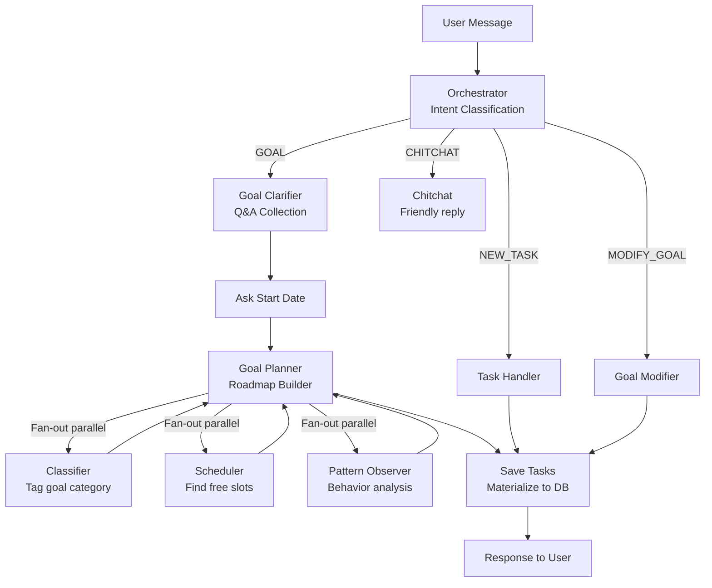

# Flux — Project Understanding Document
> Intended use: source material for a pitch deck, Google Sites SPA, or investor one-pager.
> Two layers: **Pitch Layer** (problem → solution → features → architecture wow) + **Technical Appendix** (stack, APIs, data models).

---

## Elevator Pitch

**Flux is an AI-powered personal productivity coach that turns your goals into a personalized, scheduled reality — and makes sure you actually follow through.**

You tell Flux what you want to achieve. It asks the right questions, learns your schedule and energy patterns, builds a realistic week-by-week plan, puts it on your calendar, and then follows up across push notifications, WhatsApp, and even a voice call if needed. It's not a to-do list. It's a coaching system.

---

## The Problem

Every productivity app has the same flaw: **it assumes you'll show up.** You add tasks, set reminders, and then miss them — and the app does nothing. Over time, the list grows, the guilt compounds, and the app gets deleted.

The deeper problem is that most apps ignore *you*: your sleep schedule, your peak energy hours, your tendency to skip workouts on Mondays, your actual calendar availability. They treat everyone the same.

**The result:** People who genuinely want to improve their lives are failed by the very tools meant to help them.

---

## The Solution: Flux

Flux takes a fundamentally different approach:

1. **It starts with a conversation.** Before scheduling anything, Flux learns your chronotype (are you a morning person?), your work hours, your sleep window, and your existing commitments. This is your *personal profile* — the basis for everything.

2. **It plans, not just lists.** When you set a goal ("I want to run a 5K in 6 weeks"), Flux builds a milestone roadmap with concrete weekly tasks scheduled into your *actual free slots* — respecting your sleep, your work hours, and conflicts with existing tasks.

3. **It learns from your behavior.** Every completed or missed task feeds a behavioral pattern engine. Flux notices you always skip 7am workouts but complete 6pm ones — and adjusts future scheduling accordingly.

4. **It follows up.** Flux doesn't just send one push notification and give up. It escalates: push → WhatsApp → voice call — until you confirm, reschedule, or mark the task as missed. You simply cannot ignore it the way you ignore a todo list.

5. **It reflects with you.** A weekly analytics dashboard shows your energy patterns, focus distribution, and streak — making your progress visible and reinforcing momentum.

---

## User Journey

```
Sign Up → Onboarding Chat → Goal Setup → AI Planning → Daily Schedule → Notifications → Reflection
```

### Step 1: Onboarding (2 minutes)
A conversational setup flow collects: your name, timezone, wake/sleep times, chronotype (morning/evening/neither), work hours, and phone number for notifications. Quick-select options make it fast. Most productivity apps skip this entirely.

### Step 2: Set a Goal
You chat naturally: *"I want to learn Japanese"*, *"I want to ship a side project in 6 weeks"*, *"I want to run a marathon."* Flux asks clarifying questions (how much experience? what's your target level?), then asks when you want to start.

### Step 3: AI-Generated Plan
Behind the scenes, three AI agents work in parallel:
- **Classifier** — tags the goal (health, career, learning, creative, etc.)
- **Scheduler** — finds real available slots in your calendar over 6 weeks
- **Pattern Observer** — checks your task history for behavioral trends

Then a **Goal Planner** agent assembles a milestone roadmap (e.g., 6 weekly milestones) with specific recurring tasks, realistic durations, and iCal-compatible recurrence rules. You review and approve it.

### Step 4: Daily Flow
The **Flow** page is your day view — a scrollable timeline of what to do today, color-coded by goal category. Tap any task to see details, mark it done, reschedule it, or mark it missed. The current time is always visible.

### Step 5: Smart Notifications
As a task approaches, Flux sends a push notification 10 minutes before. If you don't respond within 2 minutes, it sends a WhatsApp message. If you've set "aggressive" escalation, it places a phone call with DTMF options: press 1 (done), 2 (reschedule), 3 (missed). This is not a feature most productivity apps offer.

### Step 6: Weekly Reflection
The **Reflection** page visualizes your week: an energy aura heatmap (daily task completion intensity), a focus distribution chart (which goal categories you spent time on), and stat pills (streak, tasks done, focus hours). A text insight summarizes the week.

---

## Key Screens

| Screen | What It Does | Screenshot Hook |
|--------|-------------|-----------------|
| **Login** | Email + Google OAuth with animated inline validation | Real-time ring animations on field focus |
| **Onboarding Chat** | Conversational setup with quick-select options | Chat bubbles, quick-reply buttons |
| **Chat / Goal Setup** | Natural language goal input + clarifying Q&A | Thinking indicator showing active AI node |
| **Plan View** | Milestone roadmap with proposed tasks | Visual week-by-week card layout |
| **Flow (Timeline)** | Hourly schedule with color-coded task blocks | Current-time indicator line |
| **Task Detail Sheet** | Bottom sheet: complete / reschedule / missed | Glassmorphic overlay |
| **Reflection** | Energy aura heatmap + focus pie chart | The most visually compelling screen |
| **Profile** | Settings, notification preferences, phone verify | Clean preferences form |

---

## AI Architecture

Flux's intelligence is powered by a **LangGraph stateful agent graph** — a directed graph of 13 specialized AI nodes with PostgreSQL-backed state persistence.



**Why this architecture matters:**
- **Stateful**: Every node's output is checkpointed to PostgreSQL — the conversation can be interrupted and resumed from exactly where it left off.
- **Parallel fan-out**: Classifier, Scheduler, and Pattern Observer run simultaneously (not sequentially), cutting planning latency by ~3×.
- **Multi-model**: GPT-4o for intent classification, Claude Sonnet 4 for goal planning (highest quality), GPT-4o-mini for support tasks. Model automatically downgrades if monthly token budget is exceeded.
- **Conversational memory**: History is windowed and auto-summarized when it exceeds limits — the agent always has context without burning tokens.

**Agent intents handled:**
`GOAL` · `GOAL_CLARIFY` · `NEW_TASK` · `RESCHEDULE_TASK` · `MODIFY_GOAL` · `NEXT_MILESTONE` · `APPROVE` · `START_DATE` · `ONBOARDING` · `CHITCHAT` · `CLARIFY`

---

## Notification System

The **Notifier** is an independent background worker that runs a 60-second poll loop with a 4-step escalation cycle:

```
[Task Due in 10 min]
       ↓
 Push Notification
       ↓ (no response in 2 min)
 WhatsApp Message
       ↓ (no response in 2 min)
 Voice Call (DTMF: 1=Done, 2=Reschedule, 3=Missed)
       ↓ (no response)
 Auto-mark Missed
```

Users choose their escalation level per task:
- **Silent** — push only
- **Standard** — push + WhatsApp
- **Aggressive** — push + WhatsApp + call

Duplicate-send protection via atomic compare-and-set on timestamp fields. Each notification is logged with external IDs (MessageSid, CallSid) for idempotency.

---

## Behavioral Intelligence

Flux continuously learns from usage:

- **Pattern Observer** agent analyzes completed vs. missed tasks across days/times/categories
- Detected patterns (e.g., "User consistently misses Monday morning tasks") are stored with a confidence score (0–1)
- New goal plans are informed by these patterns — Flux won't schedule you for 7am if you always skip 7am tasks
- Cold-start users fall back to chronotype-based defaults until enough data is collected (3+ data points)
- Users can override detected patterns manually

---

## Technical Stack Summary

| Layer | Technology | Role |
|-------|-----------|------|
| **Frontend** | TanStack Start (React SSR) + Tailwind CSS v4 | Server-rendered mobile-first web app |
| **Backend** | FastAPI + Python 3.12 | REST API, SSE streaming, webhooks |
| **AI Orchestration** | LangGraph + LiteLLM → OpenRouter | Stateful multi-agent graph |
| **LLM Models** | GPT-4o · Claude Sonnet 4 · GPT-4o-mini | Intent, planning, support tasks |
| **Database** | PostgreSQL (asyncpg) + Supabase | Users, goals, tasks, patterns, messages |
| **Auth** | Supabase Auth + httpOnly cookies | Email, Google OAuth, server-side session |
| **Notifications** | Web Push (VAPID) + Twilio WhatsApp + Twilio Voice | 3-tier escalation |
| **Voice (Roadmap)** | Deepgram STT/TTS | Push-to-talk chat input |
| **Observability** | Sentry + LangSmith + Structlog | Error tracking, LLM tracing, structured logs |
| **Infrastructure** | Docker Compose (API + Notifier + Redis + Postgres + ngrok) | Local dev; production-ready containers |

---

## Data Model Overview

```
users ─────────────────────────────────────────────────────┐
  id, email, timezone, onboarded, phone_verified           │
  profile JSONB (name, chronotype, work_hours, ...)        │
  notification_preferences JSONB                           │
  monthly_token_usage JSONB                                │
                                                           │
goals ─────────────────────────────────────────────────────┤
  id, user_id → users                                      │
  title, description, status (draft/active/done/abandoned) │
  class_tags[], parent_goal_id (pipeline), pipeline_order  │
  plan_json JSONB (full GoalPlannerOutput)                  │
                                                           │
tasks ─────────────────────────────────────────────────────┤
  id, user_id → users, goal_id → goals                     │
  title, status (pending/done/missed/rescheduled)          │
  scheduled_at UTC, duration_minutes                       │
  recurrence_rule (iCal RRULE)                             │
  escalation_policy (silent/standard/aggressive)           │
  class_tags[], reminder_sent_at, whatsapp_sent_at, ...    │
                                                           │
conversations + messages ─────────────────────────────────┤
  Full chat history, LangGraph thread ID per conversation  │
  Auto-summarized via gpt-4o-mini when limits exceeded     │
                                                           │
patterns ─────────────────────────────────────────────────┘
  user_id, pattern_type, data JSONB, confidence 0–1
  Updated each time a task is missed or completed
```

---

## Integrations

| Integration | Purpose | Detail |
|-------------|---------|--------|
| **Supabase** | Auth (email + Google OAuth) | JWT validation via JWKS; httpOnly cookie sessions |
| **OpenRouter** | LLM routing | GPT-4o, Claude Sonnet 4, GPT-4o-mini via unified API |
| **LangSmith** | LLM observability | Traces every agent node and LLM call |
| **Twilio** | WhatsApp + Voice + OTP | Escalation notifications + phone verification |
| **Deepgram** | Voice STT/TTS (roadmap) | Push-to-talk: audio → text → chat → TTS reply |
| **Sentry** | Error monitoring | Frontend + backend; 20% trace sampling |
| **Web Push (VAPID)** | Browser push notifications | VAPID RSA-2048 keys, push subscription per user |

---

## Roadmap (Coming Soon)

- **Voice Input/Output** — Push-to-talk microphone in the chat interface; AI responses read aloud via Deepgram TTS. Infrastructure is already built; feature pending final integration.
- **Location Triggers** — Tasks triggered by geofence (e.g., "Review flashcards when I arrive at the gym").
- **Goal Pipeline** — Sequential milestone goals (complete Goal A → unlock Goal B) for longer-horizon life goals.
- **Calendar Sync** — Two-way sync with Google Calendar / Apple Calendar for conflict detection.
- **Team Goals** — Shared goal tracking and accountability with friends or colleagues.

---

## Screenshots & Visual Assets — Integration Guide

### Why Screenshots Matter for Pitch Materials
Flux has genuinely distinctive UI: glassmorphic cards, animated onboarding chat, a timeline flow view with color-coded task blocks, and an energy aura heatmap. These visuals communicate the product faster than words.

### Recommended Screenshot Set
Capture these 8 screens from a demo account (never real user data):

1. **Login screen** — show the animated inline validation ring
2. **Onboarding chat** — 2–3 messages visible + quick-select options
3. **Chat: Goal input + thinking indicator** — "orchestrator" node label visible
4. **Chat: Plan View** — 6-week milestone roadmap card
5. **Flow: Timeline** — day view with 3–4 color-coded tasks and current-time line
6. **Flow: Task Detail Sheet** — bottom sheet overlay (the glassmorphic effect)
7. **Reflection: Energy Aura + Focus Distribution** — most visually impressive screen
8. **WhatsApp notification** — screenshot from phone showing Flux escalation message

### How to Take Clean Screenshots
```bash
# 1. Start the app in dev mode
cd frontend && npm run dev

# 2. Open in Chrome at http://localhost:3000
# 3. DevTools → Toggle device toolbar → iPhone 14 Pro (393×852)
# 4. Zoom to 100%, hide DevTools
# 5. Use CMD+SHIFT+4 (Mac) or Windows Snipping Tool
# 6. Export as PNG at 2x resolution for crisp display
```

### Integration by Deployment Target

**A) Google Sites (simplest)**
- Upload PNGs to Google Drive → share as "Anyone with link"
- In Google Sites: Insert → Image → Google Drive
- Arrange in a 2-column grid layout using Sites' built-in grid
- Add captions below each image
- *Limitation*: No interactive carousel, no zoom, no animation. Static only.
- *Best for*: A clean, professional overview page.

**B) Google Slides / Pitch Deck**
- Insert screenshots directly into slides
- Use "Behind text" layout for hero images
- Add a "Live Demo" slide linking to a deployed demo instance
- Export as PDF for sharing

**C) Custom SPA (Vite/React hosted on Vercel or GitHub Pages)**
- Use a React lightbox library (e.g., `yet-another-react-lightbox`) for click-to-zoom
- Use `framer-motion` for scroll-triggered screenshot reveal animations (already in the project's deps)
- Embed a screen recording (Loom or MP4) as an `<video autoplay muted loop>` hero
- Host on Vercel (free tier) for a shareable URL
- *Best for*: A high-impression demo site.

**D) Screen Recording (recommended addition)**
- Record a 60–90 second walkthrough: Login → Onboarding → "I want to run a 5K" → Plan approval → Flow view → Notification
- Tools: QuickTime (Mac), OBS (cross-platform), or Loom
- Embed in Google Sites via YouTube (upload unlisted) or in a custom SPA as `<video>`
- A video demo is often more persuasive than static screenshots for AI products

### Demo Account Setup
Create a dedicated Supabase user (`demo@flux.app` or similar) with:
- Onboarding completed (chronotype: Morning, 7am–11pm, 9–5 work hours)
- 2 active goals (one health, one learning)
- A week's worth of tasks (mix of done/missed/pending)
- Patterns populated (run the app for a few sessions before screenshotting)

This ensures screenshots show a realistic, data-rich state without exposing real users.

---

## Design Language

Flux uses a consistent visual vocabulary:

- **Glassmorphism** — Cards with `backdrop-blur` and white/10 opacity; frosted glass effect throughout
- **Soft Aura gradients** — Ambient background blobs that shift by section (purple/green/amber)
- **Color palette**: Sage (#5C7C66) · Terracotta (#C27D66) · River (#8A8F8B) · Charcoal (#333)
- **Motion**: Framer Motion for all transitions — spring physics on sheets, fade-in on messages, scale on buttons
- **Mobile-first**: Max-width container (max-w-md); bottom navigation tab bar; bottom sheets instead of modals
- **Typography**: System font stack; clear size hierarchy (heading → body → caption)

---

## Security & Privacy Highlights

(For audiences that ask)

- JWT tokens live in **httpOnly cookies** — inaccessible to JavaScript, immune to XSS token theft
- Supabase keys are **server-side only** — never in the browser bundle (no `VITE_` prefix)
- All LLM calls go through **OpenRouter** — no direct exposure of model provider keys
- Deepgram API key **never reaches the client** — backend issues short-lived 120-second JWTs instead
- Rate limiting on all endpoints (20 req/min on chat, 3/hour on OTP sends)
- Twilio webhook signature validation prevents spoofed notification callbacks
- PostgreSQL Row-Level Security policies available (prepared, not yet enforced at DB layer)

---

## Decision Log (Multi-Agent Review)

| Decision | Rationale |
|----------|-----------|
| Pitch-first structure (not tech-dump) | Skeptic: raw tech lists are noise for pitch readers |
| Mermaid agent graph diagram | Skeptic: text-only architecture is unimpressive for a visual pitch |
| Screenshots section with 4 deployment paths | Constraint Guardian: Google Sites ≠ custom SPA; different constraints |
| Demo account recommendation | Constraint Guardian: public materials must not expose real user data |
| Voice framed as roadmap, not "in development" | User Advocate: disclaimers weaken pitch momentum |
| Technical appendix separated from pitch layer | User Advocate: investors ≠ developers; conflating them loses both |
| Notification escalation explained in human terms | Skeptic + User Advocate: "Flux doesn't let you forget" is the hook |
