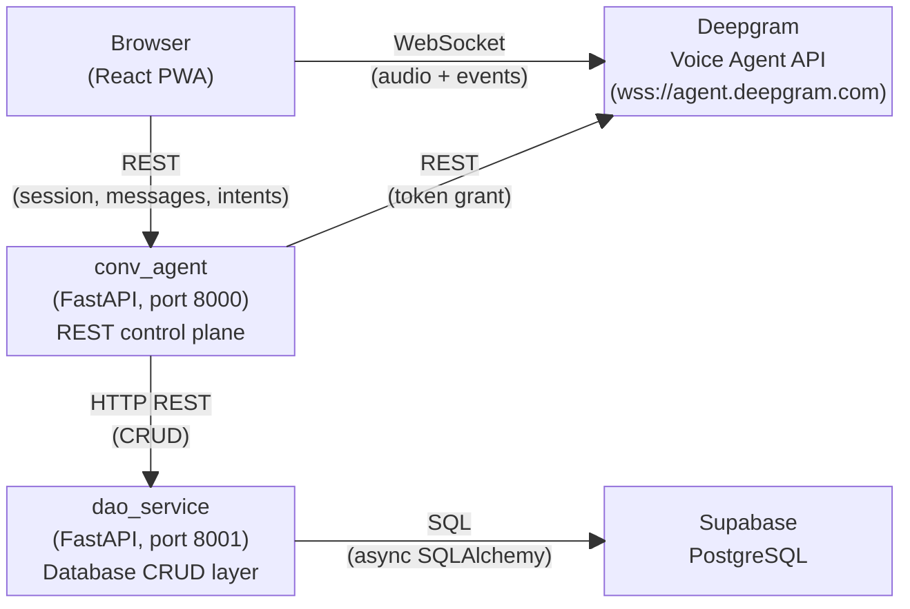
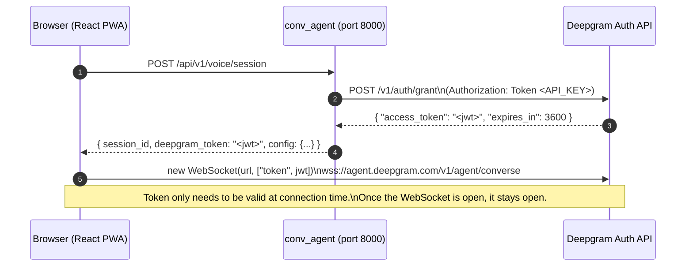
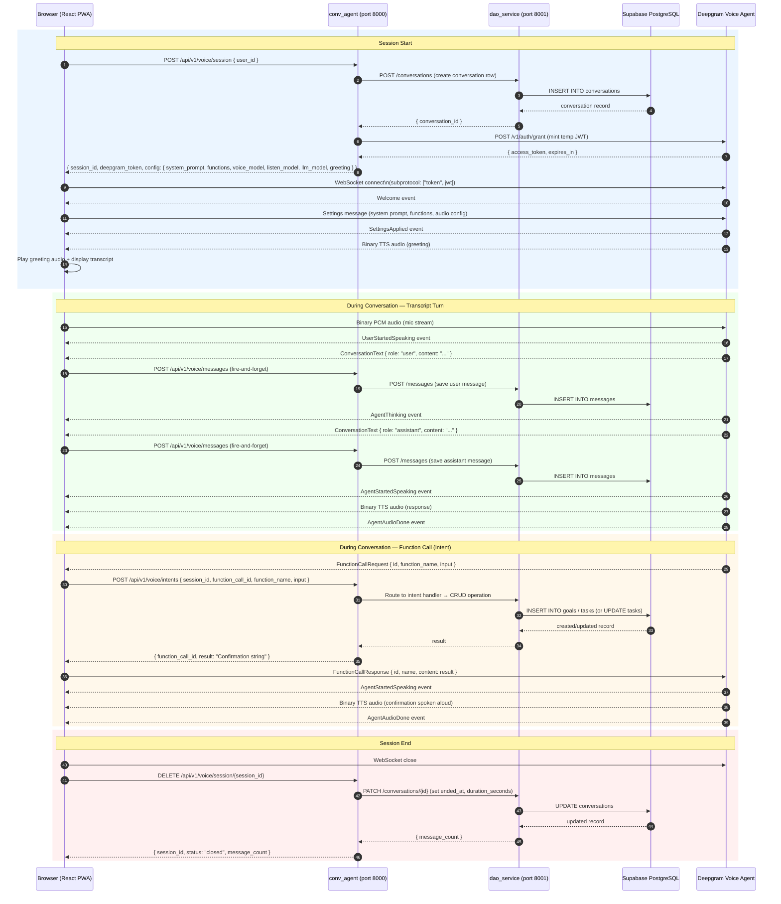
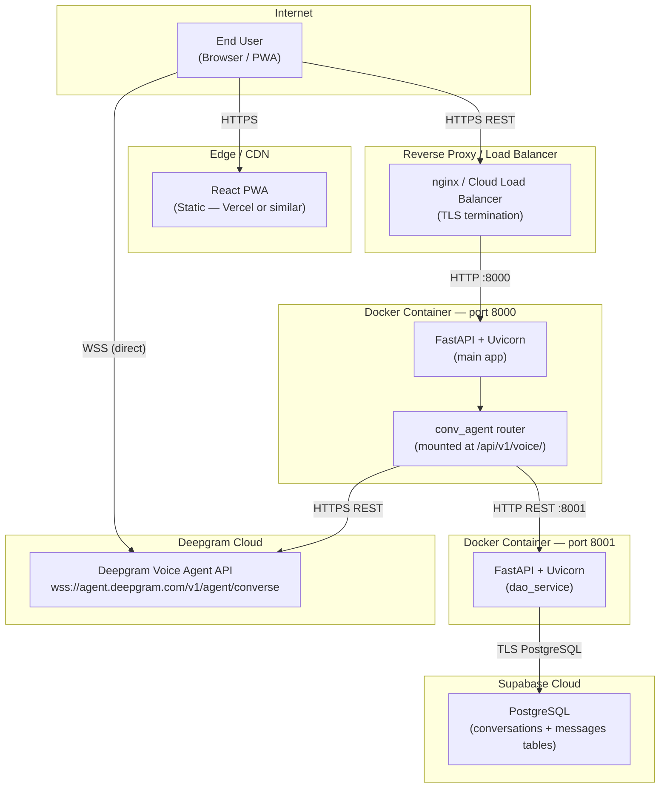

# Architecture Overview

## What We Are Building

A voice conversation mode for the Flux app. The user taps a mic button, speaks naturally, and the AI extracts their intent through conversation. Once the intent is clear, it is submitted to the existing Goal Planner and Task system.

**Core behaviors:**
- Real-time voice conversation via Deepgram Voice Agent API
- Live transcriptions displayed as chat bubbles
- All messages persisted to the database
- Past conversations loadable and resumable
- Configurable intent registry (YAML) and system prompt (Markdown)
- Ships with three intents: `submit_goal_intent`, `submit_new_task_intent`, `submit_reschedule_intent`

**Auth:** Mocked for now. A `get_current_user()` dependency returns a hardcoded `user_id`.

---

## Deepgram Voice Agent API

The Deepgram Voice Agent API provides a single WebSocket that bundles STT, LLM, and TTS into one managed pipeline. Key capabilities used in this system:

- **Single WebSocket** — browser connects directly, sends mic audio, receives TTS audio and JSON events
- **Pluggable LLM** — GPT-4o-mini by default; swappable to any supported model
- **Pluggable TTS** — Deepgram Aura by default; swappable to any supported voice
- **Built-in function calling** — the LLM invokes client-side functions, which is the mechanism for intent extraction
- **Turn detection** — silence detection and barge-in are handled server-side by Deepgram
- **Temp token auth** — the backend mints a short-lived JWT so the browser connects without exposing the raw API key

---

## High-Level Architecture

The diagram below shows all system components and how they communicate. The browser maintains two independent connections: one REST channel to the `conv_agent` backend and one WebSocket directly to Deepgram. **The backend never handles audio.**

### Key Design Decision: Direct Browser-to-Deepgram Connection

The browser connects **directly** to Deepgram via WebSocket. The `conv_agent` backend is a **REST-only control plane** — it never proxies audio and never manages WebSocket connections.

| Connection | From | To | Carries |
|---|---|---|---|
| Deepgram WebSocket | React PWA | Deepgram | Binary PCM audio + JSON events (transcripts, function calls, status) |
| Session REST | React PWA | conv_agent | Session creation, message persistence, intent processing |
| Token grant | conv_agent | Deepgram | API key authentication to mint short-lived JWT |
| DAO calls | conv_agent | dao_service | All database CRUD operations |

**Benefits of this design:**
- Backend stays simple — pure REST, no WebSocket or audio handling
- Lower latency — audio travels directly to Deepgram, with no intermediate hop
- Less code — no binary frame management, connection bridging, or audio buffering

---

## Token Authentication Flow

Deepgram requires an API key to open its WebSocket. The raw API key is never sent to the browser. Instead:

---

## Overall Session Sequence Diagram

This diagram covers the complete session lifecycle: from session creation through an active conversation (including transcript persistence and a function call) through session end.

---

## Deployment Architecture

**Deployment notes:**
- The `conv_agent` router is mounted inside the main FastAPI application — it is not a separate process. Both share port 8000.
- The `dao_service` runs as a separate Docker container on port 8001 and is not publicly accessible — it is called only by the backend.
- Supabase manages connection pooling, backups, and TLS for the database.
- The browser WebSocket to Deepgram is a direct connection — it does not pass through the reverse proxy.

---

## Data Flow Summary

### Session Start
1. Client calls `POST /api/v1/voice/session` — backend creates a conversation row in `dao_service`, mints a Deepgram temp token, loads the system prompt and intent function definitions, then returns all of it to the client.
2. Client opens a WebSocket to `wss://agent.deepgram.com/v1/agent/converse` using the temp token.
3. Client sends a `Settings` message to Deepgram (system prompt, tools, audio config).
4. Deepgram confirms with `SettingsApplied` and speaks the greeting — client plays audio and displays transcript.

### During Conversation
1. Client streams mic audio (binary PCM) directly to Deepgram.
2. Deepgram transcribes speech and sends `ConversationText` events — client displays the text and persists it to the backend via `POST /api/v1/voice/messages` (fire-and-forget).
3. Deepgram generates a response, sends audio and a corresponding transcript — client plays audio, displays text, and persists to backend.
4. If a function call occurs: Deepgram sends `FunctionCallRequest` → client forwards it to `POST /api/v1/voice/intents` → backend routes to the appropriate handler → backend returns a result string → client sends `FunctionCallResponse` to Deepgram → Deepgram speaks the confirmation.

### Session End
1. Client closes the Deepgram WebSocket.
2. Client calls `DELETE /api/v1/voice/session/{id}` — backend marks the conversation closed with `ended_at` and `duration_seconds`.

---

## Related Documents

- [Deepgram Integration Details](./02_deepgram_integration.md)
- [Backend Design](./03_backend_design.md)
- [Frontend Design](./04_frontend_design.md)
- [Configuration](./05_configuration.md)
- [Database Schema](./06_database.md)
- [Implementation Plan](./07_implementation_plan.md)
