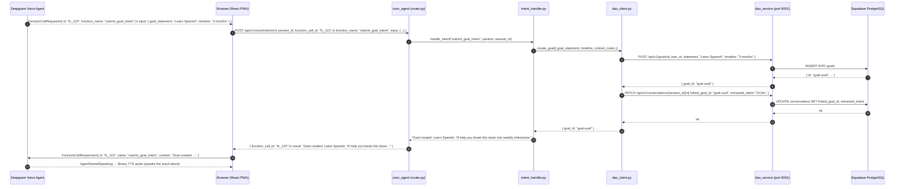
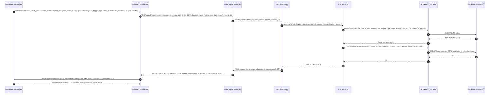
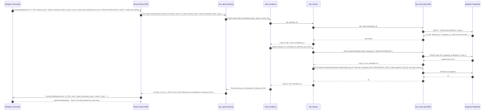

# Backend Design

The backend is a **REST-only control plane**. It never touches audio or manages WebSocket connections. Its responsibilities are: mint Deepgram tokens, persist messages, and process intent function calls.

---

## File Structure

The `conv_agent` module lives at `backend/conv_agent/` — it is mounted as a router into the main FastAPI application (`backend/app/main.py`), not nested inside `backend/app/`.

```
backend/
├── app/
│   ├── config.py              # Main app config (database, RAG, OpenRouter)
│   └── main.py                # Mounts conv_agent router + other routers
│
├── conv_agent/                # conv_agent module (router mounted into app/main.py)
│   ├── __init__.py
│   ├── config.py              # Deepgram settings + dao_service URL
│   ├── router.py              # 5 REST endpoints at /api/v1/voice/
│   ├── voice_service.py       # Token minting, session CRUD, message persistence
│   ├── intent_handler.py      # Intent dispatch to goal/task/reschedule handlers
│   ├── dao_client.py          # Async HTTP client for dao_service (port 8001)
│   ├── schemas.py             # Pydantic request/response models
│   ├── mocks.py               # In-memory mocks for unit testing
│   ├── config/
│   │   ├── voice_prompt.md    # System prompt for Deepgram LLM
│   │   └── intents.yaml       # Intent function definitions (loaded at session start)
│   └── tests/
│       ├── conftest.py
│       ├── test_router.py
│       ├── test_voice_service.py
│       ├── test_intent_handler.py
│       └── test_integration.py
│
└── dao_service/               # Separate service — runs on port 8001
```

**200-line rule:** No file exceeds 200 lines (excluding imports and docstrings).

---

## API Endpoints

All endpoints are prefixed at `/api/v1/voice/`.

### `POST /api/v1/voice/session`

Creates a new voice session. Mints a Deepgram temp token and returns it along with the session configuration so the client can connect directly to Deepgram.

**Request:**
```json
{ "user_id": "string" }
```

**Steps:**
1. Validate `user_id` (mock auth for MVP — `get_current_user()` returns a hardcoded value).
2. Load user profile and today's tasks from `dao_service` (for context injection into the system prompt).
3. Create a conversation record via `dao_service`.
4. Mint a Deepgram temp token via `POST https://api.deepgram.com/v1/auth/grant`.
5. Load the system prompt from `config/voice_prompt.md` and append user context.
6. Load function definitions from `config/intents.yaml`.
7. Return the token and full configuration to the client.

**Response:**
```json
{
  "session_id": "uuid",
  "deepgram_token": "eyJ...",
  "config": {
    "system_prompt": "You are Flux, a warm...",
    "functions": [{ "name": "submit_goal_intent" }],
    "voice_model": "aura-2-thalia-en",
    "listen_model": "nova-3",
    "llm_model": "gpt-4o-mini",
    "greeting": "Hey! What can I help you with today?"
  }
}
```

The client uses `deepgram_token` to open the Deepgram WebSocket and uses `config` to build the `Settings` message.

---

### `POST /api/v1/voice/messages`

Persists a transcript message. Called by the client for every `ConversationText` event — fire-and-forget (client does not block on the response).

**Request:**
```json
{
  "session_id": "uuid",
  "role": "user",
  "content": "I want to learn Spanish"
}
```

**Response:**
```json
{ "message_id": "uuid", "status": "saved" }
```

---

### `GET /api/v1/voice/sessions/{session_id}/messages`

Returns all messages for a session, ordered by `created_at`. Used to load past conversation transcripts.

**Response:**
```json
{
  "session_id": "uuid",
  "messages": [
    { "id": "uuid", "role": "user", "content": "...", "created_at": "..." },
    { "id": "uuid", "role": "assistant", "content": "...", "created_at": "..." }
  ]
}
```

---

### `POST /api/v1/voice/intents`

Processes a Deepgram `FunctionCallRequest` forwarded by the client. Validates the payload, routes to the appropriate intent handler, and returns a result string that the client sends back to Deepgram as a `FunctionCallResponse`.

**Request:**
```json
{
  "session_id": "uuid",
  "function_call_id": "fc_123",
  "function_name": "submit_goal_intent",
  "input": {
    "goal_statement": "Learn Spanish",
    "timeline": "3 months"
  }
}
```

**Response:**
```json
{
  "function_call_id": "fc_123",
  "result": "Goal created: Learn Spanish. I'll help you break this down into weekly milestones."
}
```

The client takes `result` and sends it as the `content` field in a `FunctionCallResponse` to Deepgram. Deepgram then speaks the confirmation aloud.

---

### `DELETE /api/v1/voice/session/{session_id}`

Marks the session closed. Updates `ended_at` and `duration_seconds` on the conversation record.

**Response:**
```json
{ "session_id": "uuid", "status": "closed", "message_count": 12 }
```

---

## Core Services

### VoiceService (`voice_service.py`)

Handles token minting, config loading, session CRUD, and message persistence. Calls `dao_client.py` for all database operations.

```python
class VoiceService:
    """Token minting, config loading, session CRUD, message persistence."""

    async def mint_deepgram_token(self) -> str:
        """POST to Deepgram auth/grant → returns temp JWT."""

    async def load_system_prompt(self) -> str:
        """Read config/voice_prompt.md from disk."""

    async def load_intents(self) -> list[dict]:
        """Read config/intents.yaml, convert to Deepgram function definitions."""

    async def create_session(self, user_id: str) -> str:
        """Create conversation row via dao_service. Returns conversation_id."""

    async def close_session(self, session_id: str) -> int:
        """Mark conversation closed. Returns message count."""

    async def save_message(self, session_id: str, role: str, content: str) -> str:
        """Insert message row via dao_service. Returns message_id."""

    async def get_messages(self, session_id: str) -> list[dict]:
        """Fetch all messages for a session from dao_service."""
```

### IntentHandler (`intent_handler.py`)

Routes function calls to the appropriate dao_service operation. Returns a human-readable result string for the `FunctionCallResponse`.

```python
class IntentHandler:
    """Dispatches Deepgram function calls to dao_service operations."""

    async def handle_intent(self, function_name: str, params: dict, session_id: str) -> str:
        """
        Dispatch to _handle_goal, _handle_create_task, or _handle_reschedule.
        Returns a result string for FunctionCallResponse.content.
        Unknown function names return an error string (never raise).
        """

    async def _handle_goal(self, params: dict, session_id: str) -> str:
        """Create goal row via dao_service. Links goal_id to conversation."""

    async def _handle_create_task(self, params: dict, session_id: str) -> str:
        """Create task row via dao_service. Links task_id to conversation."""

    async def _handle_reschedule_task(self, params: dict, session_id: str) -> str:
        """Look up task by task_id, update scheduled_at via dao_service."""
```

### DAOClient (`dao_client.py`)

Thin async HTTP client wrapping all calls to `dao_service` on port 8001. Uses `httpx.AsyncClient`.

---

## Intent Sequence Diagrams

The following diagrams show the complete processing chain for each of the three voice intents. Every intent starts with a `FunctionCallRequest` event received by the browser from Deepgram, and ends with the browser sending a `FunctionCallResponse` back to Deepgram.

### `submit_goal_intent`

Triggered when the LLM has extracted a user goal through conversation.

**Parameters:** `goal_statement` (required), `timeline` (optional), `context_notes` (optional).



---

### `submit_new_task_intent`

Triggered when the LLM has extracted a new task the user wants to schedule.

**Parameters:** `title` (required), `trigger_type` (`time` or `location`), `scheduled_at` (ISO 8601), `recurrence_rule` (optional), `location_trigger` (optional).



---

### `submit_reschedule_intent`

Triggered when the user asks to move an existing task to a new time.

**Parameters:** `task_id` (required), `preferred_new_time` (ISO 8601 or natural language), `reason` (optional).



---

## Scope Boundary

The backend handles **control plane only** — it never touches audio or manages persistent connections. Specifically:

- No WebSocket endpoints
- No audio streaming or binary frame handling
- No Deepgram connection management
- No in-memory session state

The backend is stateless between requests. It performs CRUD via `dao_service` and makes one HTTP call to Deepgram to mint tokens.

---

## Rate Limiting

| Limit | Value |
|---|---|
| Session creation | 5 per user per 10 minutes |
| Daily sessions | 20 per user |
| Concurrent sessions | 1 per user |

Implemented as an in-memory counter for MVP, keyed by `user_id` with timestamps.
