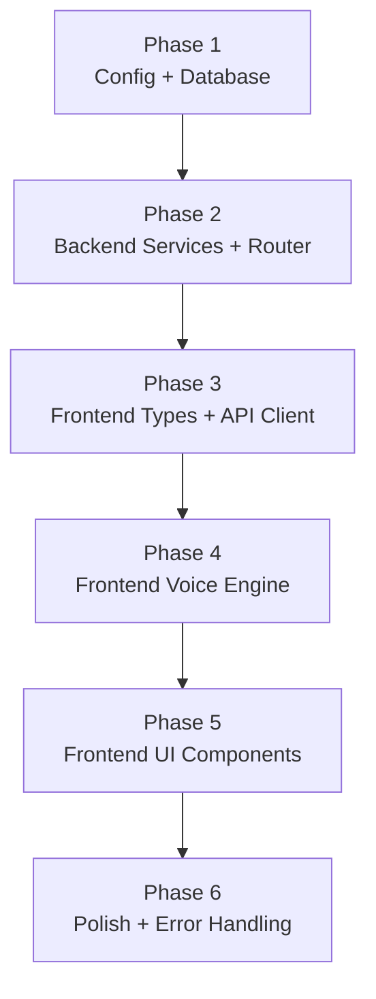

# Implementation Plan

Phased build order. Each phase is independently testable.

---

## Phase 1: Config + Database (Day 1)

**Goal:** Config files exist, database is ready, Pydantic schemas defined.

### Tasks
1. Create `conv_agent/config/voice_prompt.md` with the system prompt.
2. Create `conv_agent/config/intents.yaml` with the three intent definitions.
3. Add Deepgram settings to `conv_agent/config.py` — `deepgram_api_key`, `deepgram_voice_model`, `deepgram_listen_model`, `deepgram_llm_model`, `deepgram_token_ttl`, and `dao_service_url`.
4. Create `conv_agent/schemas.py` — Pydantic request/response models.
5. Run SQL migrations: create `messages` table, alter `conversations` table with voice columns.
6. Add the `Message` SQLAlchemy model and Pydantic schemas to `dao_service`.

### Tests
- `test_voice_schemas` — all Pydantic models serialize and deserialize correctly.
- `test_settings_loads_deepgram_key` — Settings loads `DEEPGRAM_API_KEY` from the environment.
- Verify migration: `messages` table exists and `conversations` has the new voice columns.

### Deliverable
Config files ready. Database accepts voice sessions and messages.

---

## Phase 2: Backend Services + Router (Day 2-3)

**Goal:** REST API fully working — can create sessions (mint tokens), persist messages, and process intents.

### Tasks
1. Build `conv_agent/voice_service.py` — `mint_deepgram_token()`, `load_system_prompt()`, `load_intents()`, `create_session()`, `close_session()`, `save_message()`, `get_messages()`.
2. Build `conv_agent/intent_handler.py` — `handle_intent()` dispatcher routing to `_handle_goal()`, `_handle_create_task()`, `_handle_reschedule_task()`.
3. Build `conv_agent/dao_client.py` — async httpx client for all `dao_service` calls.
4. Build `conv_agent/router.py` — 5 REST endpoints: `POST /session`, `POST /messages`, `GET /sessions/{id}/messages`, `POST /intents`, `DELETE /session/{id}`.
5. Mount the `conv_agent` router in `backend/app/main.py`.
6. Add `pyyaml` and `httpx` to `requirements.txt`.

### Tests
- `test_mint_deepgram_token` — mock `httpx.post`, verify correct URL, headers, and response parsing.
- `test_create_session` — mock `dao_client`, verify conversation row created.
- `test_save_message` — mock `dao_client`, verify message row inserted.
- `test_handle_goal_intent` — mock `dao_client.create_goal`, verify correct arguments passed.
- `test_handle_create_task_intent` — verify task row inserted with correct fields.
- `test_handle_reschedule_intent` — verify task looked up and `scheduled_at` updated.
- `test_handle_unknown_function` — verify an error string is returned, not an exception raised.
- `test_voice_router_endpoints` — TestClient tests for all 5 endpoints using `mocks.py`.

### Deliverable
Backend fully functional. All endpoints testable with curl or Postman.

---

## Phase 3: Frontend Types + API Client (Day 3)

**Goal:** TypeScript types and REST client ready for the voice engine.

### Tasks
1. Create `src/types/voice.ts` — types for backend responses and Deepgram WebSocket events.
2. Create `src/api/voiceApi.ts` — REST client: `createSession()`, `saveMessage()`, `processIntent()`, `endSession()`.

### Tests
- `npx tsc --noEmit` — verify all types compile without errors.

### Deliverable
Frontend can call the backend. Types are ready for the voice engine.

---

## Phase 4: Frontend Voice Engine (Day 4)

**Goal:** Core voice engine works — direct Deepgram WebSocket, mic capture, audio playback.

### Tasks
1. Build `src/voice/DeepgramClient.ts` — WebSocket manager (connect with token, send Settings, handle events, send audio, KeepAlive, FunctionCallResponse).
2. Build `src/voice/AudioEngine.ts` — mic capture via `ScriptProcessorNode` and TTS playback via `AudioContext` queue.
3. Build `src/voice/useVoiceAgent.ts` — React hook orchestrating `DeepgramClient`, `AudioEngine`, and `voiceApi`.

### Tests
- Manual browser test: connect to Deepgram, speak, verify audio plays back.
- Unit test `float32ToInt16` / `int16ToFloat32` PCM conversion utilities.

### Deliverable
Can conduct a voice conversation from the browser using `useVoiceAgent`.

---

## Phase 5: Frontend UI Components (Day 5)

**Goal:** Voice button, overlay, and integration into the chat page.

### Tasks
1. Build `src/components/voice/VoiceFAB.tsx` — mic button with animated states (idle, listening, processing, speaking).
2. Build `src/components/voice/VoiceOverlay.tsx` — full-screen overlay with transcript feed and end button.
3. Modify `src/components/chat/ChatInput.tsx` — add voice button (visible when text input is empty).
4. Modify `src/routes/chat.tsx` — wire `useVoiceAgent`, render `VoiceOverlay`, handle toggle.

### Tests
- Manual E2E: tap mic → grant permission → speak → see transcript → agent responds → tap end.
- Verify existing text chat still works when voice is not active.
- Test all voice button states render correctly.

### Deliverable
Full voice UI working in the browser.

---

## Phase 6: Polish + Error Handling (Day 6-7)

**Goal:** Robust error handling, rate limiting, and conversation history.

### Tasks
1. Add mic permission error handling — show fallback message if permission denied.
2. Add WebSocket disconnect handling — show error banner and end session gracefully.
3. Add rate limiting on session creation (in-memory counter).
4. Add conversation history: `GET /api/v1/voice/sessions/{id}/messages` for loading past conversations.
5. Test on mobile browser (Safari and Chrome).
6. Add intent metadata persistence on the conversation record (`extracted_intent`, `intent_payload`).

### Tests
- `test_rate_limit_exceeded` — returns HTTP 429.
- `test_concurrent_session_blocked` — second session is rejected.
- Manual: test on mobile Safari and Chrome.

### Deliverable
Robust, complete voice agent feature with inline documentation in code and tests.

---

## Dependency Graph

**Parallelization notes:**
- Phases 2 and 3 can be worked in parallel — frontend types depend only on schema shapes, not a running backend.
- Phases 4 and 2 can be parallelized across two developers.

---

## Tech Stack Summary

| Component | Technology | Purpose | How Used |
|---|---|---|---|
| Backend framework | FastAPI + Uvicorn | Async Python web framework for the REST control plane | Defines the 5 voice endpoints in `router.py`; Uvicorn runs the ASGI server |
| Request/response validation | Pydantic v2 + pydantic-settings | Schema validation and settings management | All request and response models in `schemas.py`; environment variables loaded via `conv_agent/config.py` |
| Async HTTP client | httpx | Makes async HTTP calls from the backend | Mints Deepgram tokens via `POST /v1/auth/grant` in `voice_service.py`; calls `dao_service` REST API in `dao_client.py` |
| Intent config loader | PyYAML | Parses the intent function definitions at session start | Reads `conv_agent/config/intents.yaml` and converts definitions into the Deepgram function calling format |
| Voice AI pipeline | Deepgram Voice Agent API | Managed STT + LLM + TTS over a single WebSocket | Browser connects directly to `wss://agent.deepgram.com/v1/agent/converse`; backend never touches this connection |
| Conversation LLM | GPT-4o-mini (via Deepgram) | Generates conversational responses and triggers function calls (intents) | Configured in the `Settings` message sent by the browser to Deepgram at session start |
| Speech-to-text | Deepgram Nova-3 | Transcribes user microphone audio to text | Configured as the `listen` provider in the `Settings` message |
| Text-to-speech | Deepgram Aura | Synthesizes agent responses into audio | Configured as the `speak` provider in the `Settings` message; binary PCM audio frames returned from Deepgram |
| Database ORM | SQLAlchemy (async) | Async ORM for database access in dao_service | Maps `Conversation` and `Message` models to Supabase PostgreSQL tables; used with `asyncpg` driver |
| Database | Supabase PostgreSQL | Persistent storage for conversations and messages | Stores `conversations` table (with voice columns) and `messages` table; managed cloud PostgreSQL |
| Frontend framework | React 18 + TypeScript | Builds the PWA UI and manages voice session state | `useVoiceAgent` hook orchestrates the WebSocket, audio, and REST calls; `VoiceFAB` and `VoiceOverlay` are React components |
| Microphone capture | Web Audio API (ScriptProcessorNode) | Captures microphone audio at 16 kHz PCM | `AudioEngine.ts` uses `getUserMedia` and `ScriptProcessorNode` to capture, downsample, and convert mic input to `linear16` PCM for Deepgram |
| Audio playback | Web Audio API (AudioContext + BufferSource) | Plays back TTS audio returned from Deepgram | `AudioEngine.ts` queues binary PCM frames into `AudioBufferSourceNode` objects and plays them sequentially via `AudioContext` |
| Browser WebSocket | Browser native WebSocket | Connects the browser directly to the Deepgram Voice Agent API | `DeepgramClient.ts` opens `new WebSocket(url, ["token", jwt])` — no SDK needed |
| Frontend REST client | Browser native fetch | Calls conv_agent REST endpoints from the browser | `voiceApi.ts` wraps `createSession()`, `saveMessage()`, `processIntent()`, and `endSession()` calls |
| State management | React hooks (useState / useRef) | Manages voice session and UI state within the chat page | `useVoiceAgent` holds WebSocket ref, audio engine ref, session ID, and transcript state; no external state library needed |
| Styling | Tailwind CSS | Utility-first CSS for UI components | Styles `VoiceFAB`, `VoiceOverlay`, and animated mic button states |
| Testing framework | pytest + pytest-asyncio | Runs async unit and integration tests for Python services | Test files in `conv_agent/tests/` and `dao_service/tests/`; async fixtures defined in `conftest.py` |
| Test isolation | unittest.mock | Patches external dependencies in unit tests | Patches `dao_client` calls and Deepgram HTTP calls so tests run without real services |
