# Voice-to-Voice Conversational Agent

## 1. What We Are Building

A voice conversation mode for the Flux app — similar to ChatGPT's voice mode. The user taps a mic button, speaks naturally, and the AI extracts their intent through conversation. Once the intent is clear, it is submitted to the Orchestrator Agent.

**Core behaviors:**
- Real-time voice conversation (speech-to-speech, not STT->LLM->TTS)
- Live transcriptions displayed as chat bubbles alongside voice
- All messages persisted to database
- Past conversations loadable and resumable
- Configurable intent registry — intents defined in YAML, system prompt in markdown
- Currently ships with three intents: **GOAL**, **NEW_TASK**, **RESCHEDULE_TASK**

**Auth note:** Authentication is mocked for now. A `get_current_user()` dependency returns a hardcoded or header-injected user_id. Real auth (Supabase JWT) will be integrated later.

---

## 2. Technology: OpenAI Realtime API

| Property | Value |
|----------|-------|
| Model | `gpt-4o-realtime-preview` |
| Transport (client) | WebRTC (lowest latency, ~250ms) |
| Transport (backend) | Companion WebSocket to same session |
| Audio format | 16kHz PCM in, 24kHz PCM out |
| Transcription | Built-in (Whisper-1) for user speech; streamed text for model speech |
| Function calling | Non-blocking; model can speak while backend processes |
| Turn-taking | Server-side VAD with interruption support |

**Key insight:** Audio flows directly between the client and OpenAI via WebRTC. Our backend never touches audio — it only handles control signals (session setup, transcript persistence, function call interception).

---

## 3. Architecture Overview

```
User's voice
    |
    v
[React PWA] ---WebRTC audio---> [OpenAI Realtime API]
    ^    ^                            |         |
    |    |                            |         |
    |    +--WebRTC audio (voice)------+         |
    |                                           |
    |    transcript events +                    |
    |    function_call events                   |
    |                                           v
    |                              [FastAPI Backend] <-- companion WebSocket
    |                                           |
    +---SSE (persisted messages)----------------+
                                                |
                                persist + validate + forward
                                                |
                                                v
                                    [Orchestrator Agent]
                                                |
                                                v
                                         [Supabase DB]
```

**Three connections are established per voice session:**

| Connection | From | To | Carries |
|------------|------|----|---------|
| WebRTC | React PWA | OpenAI | Bidirectional audio |
| Companion WebSocket | FastAPI Backend | OpenAI | Control signals, transcripts, function calls |
| SSE | React PWA | FastAPI Backend | Persisted message events |

### 3.1 Component Architecture Diagram

Shows all services, components, frameworks, and their runtime interactions across every layer of the system.

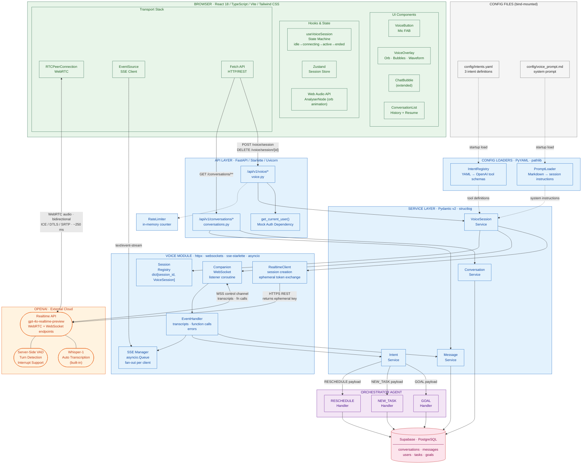

---

### 3.2 Deployment Architecture Diagram

Shows infrastructure topology, containerisation, network paths, and how traffic flows from the user's device to each service.

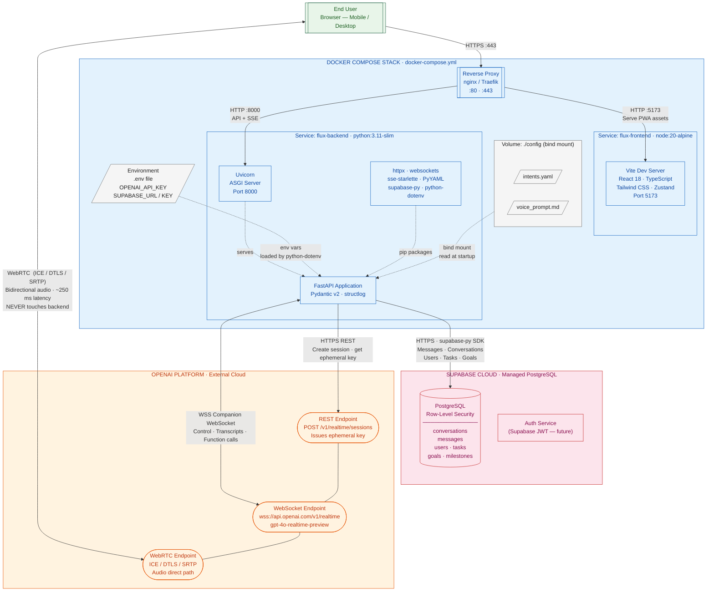

---

## 4. High-Level Flowchart

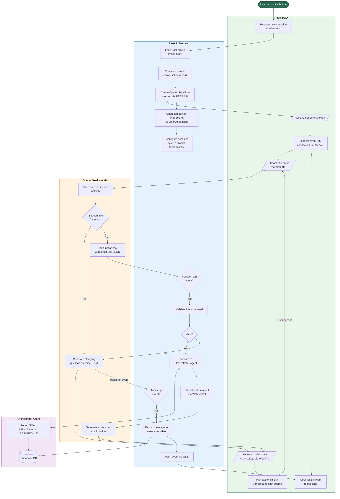

---

## 5. Sequence Diagrams

### 5.1 Session Initialization (Common to All Flows)

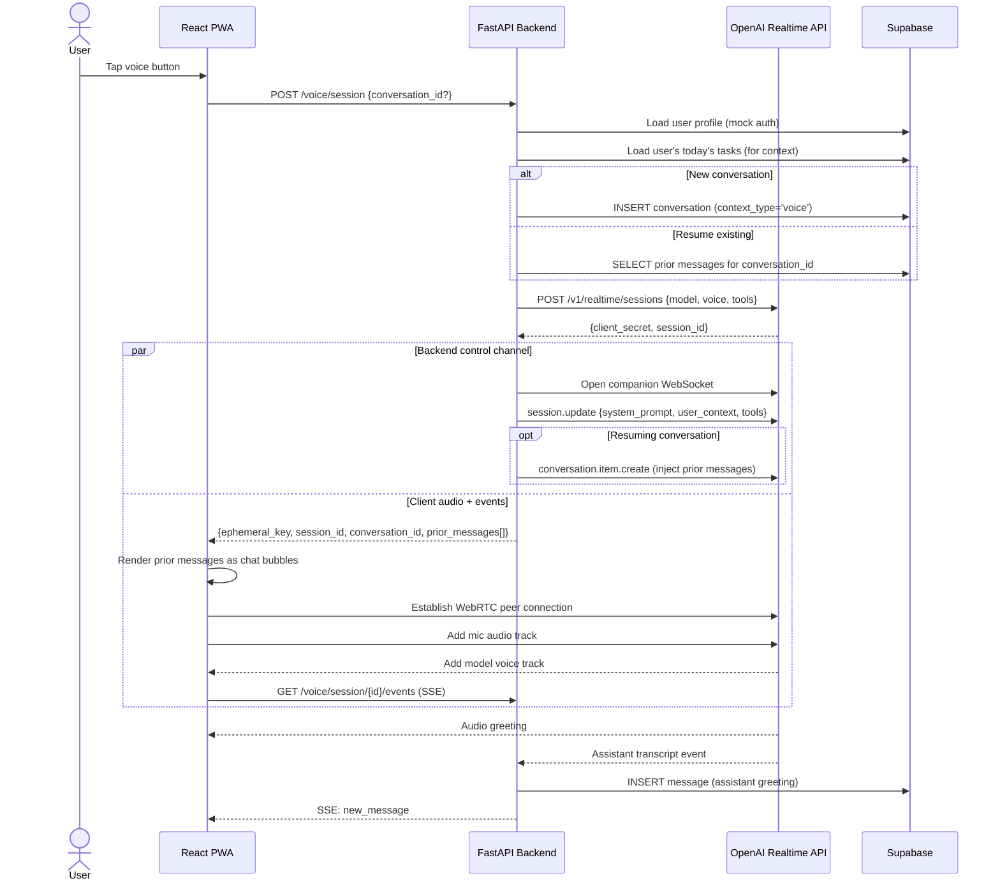

### 5.2 GOAL Intent Flow

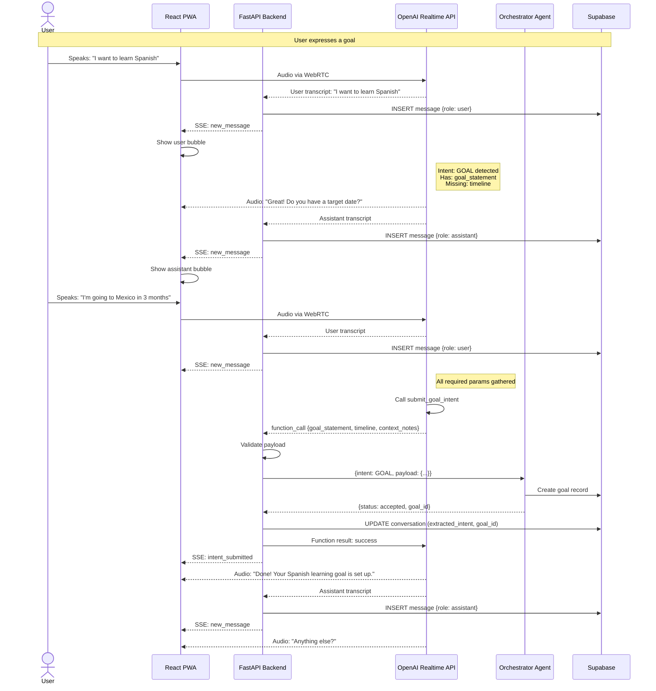

### 5.3 NEW_TASK Intent Flow (Time-Triggered)

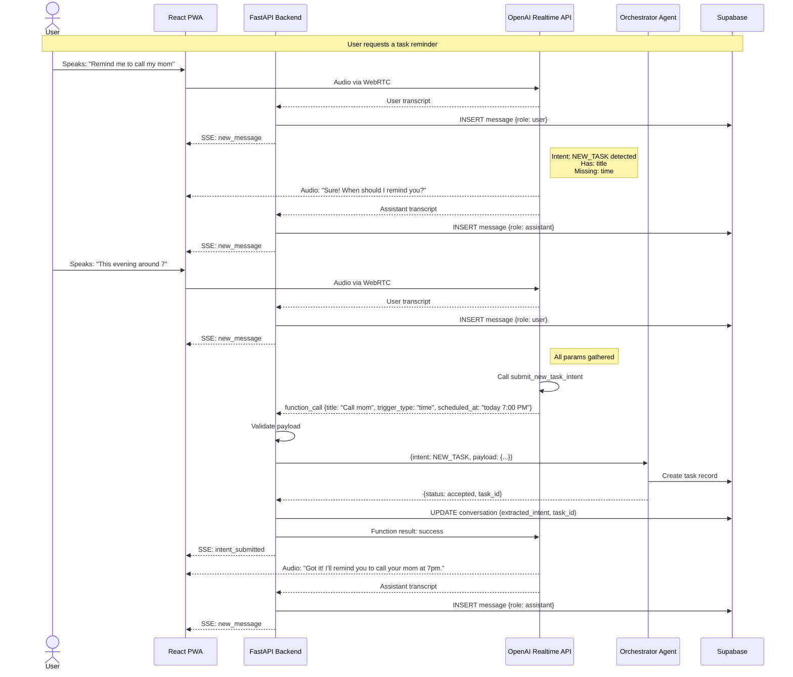

### 5.4 NEW_TASK Intent Flow (Location-Triggered)

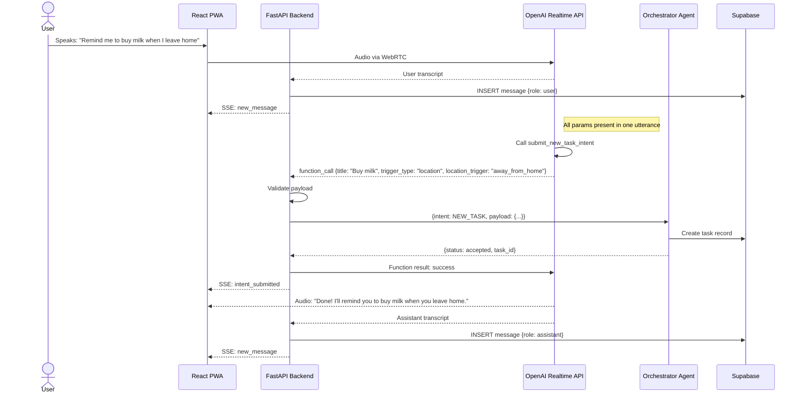

### 5.5 NEW_TASK Intent Flow (Recurring)

```mermaid
sequenceDiagram
    actor User
    participant PWA as React PWA
    participant API as FastAPI Backend
    participant OAI as OpenAI Realtime API
    participant Orch as Orchestrator Agent
    participant DB as Supabase

    User->>PWA: Speaks: "I want to meditate every morning at 6am"
    PWA->>OAI: Audio via WebRTC
    OAI-->>API: User transcript
    API->>DB: INSERT message {role: user}
    API-->>PWA: SSE: new_message

    Note right of OAI: Has: title, time<br/>Missing: which days?

    OAI-->>PWA: Audio: "Every day, or specific days?"
    OAI-->>API: Assistant transcript
    API->>DB: INSERT message {role: assistant}
    API-->>PWA: SSE: new_message

    User->>PWA: Speaks: "Weekdays only"
    PWA->>OAI: Audio via WebRTC
    OAI-->>API: User transcript
    API->>DB: INSERT message {role: user}
    API-->>PWA: SSE: new_message

    OAI->>OAI: Call submit_new_task_intent
    OAI-->>API: function_call {title: "Meditate", trigger_type: "time", scheduled_at: "6:00 AM", recurrence_rule: "FREQ=WEEKLY;BYDAY=MO,TU,WE,TH,FR"}

    API->>Orch: {intent: NEW_TASK, payload: {...}}
    Orch->>DB: Create recurring task
    Orch-->>API: {status: accepted, task_id}
    API->>OAI: Function result: success
    API-->>PWA: SSE: intent_submitted

    OAI-->>PWA: Audio: "Set! Meditation every weekday at 6am."
    OAI-->>API: Assistant transcript
    API->>DB: INSERT message {role: assistant}
    API-->>PWA: SSE: new_message
```

### 5.6 RESCHEDULE_TASK Intent Flow

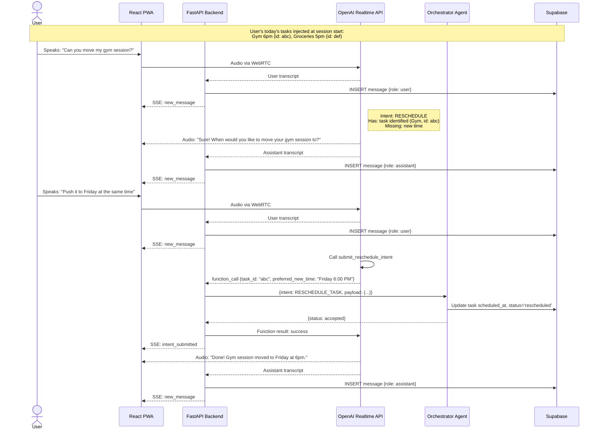

### 5.7 Multiple Intents in One Session

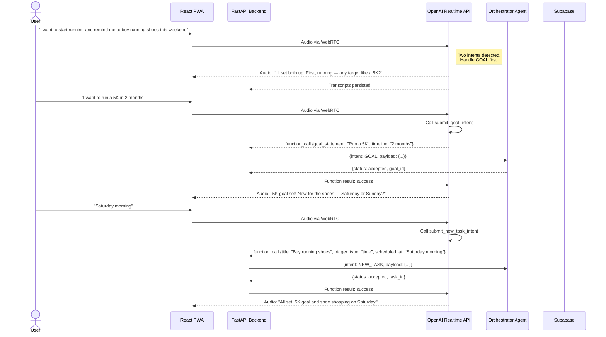

### 5.8 Session Teardown

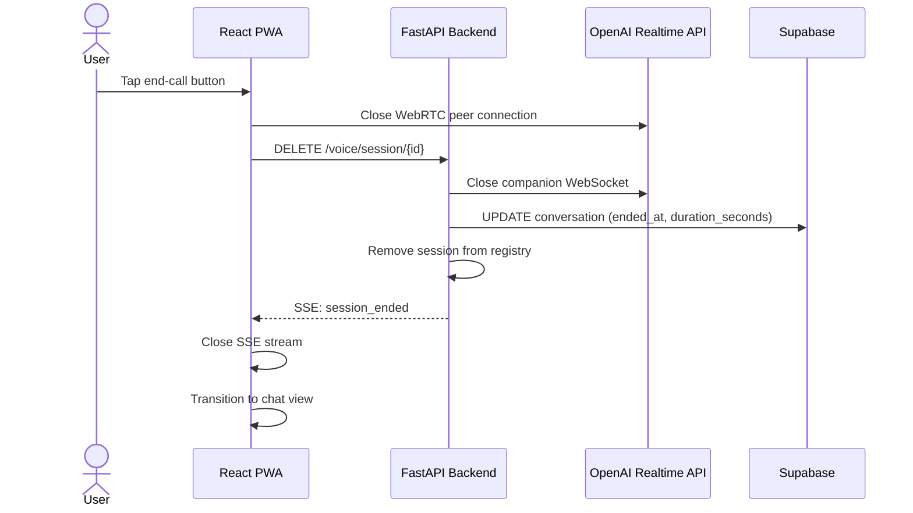

### 5.9 Misunderstanding Recovery Flow

This diagram covers three scenarios: garbled/inaudible speech, off-topic input, and ambiguous utterances that could match multiple intents.

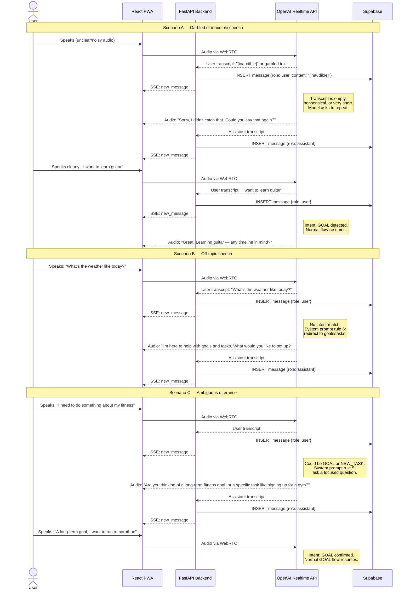

---

## 6. Configuration: Intent Registry + System Prompt

The voice agent is configured via two files. This separation makes the system reusable for different use cases — swap the files and you have a different voice agent.

### 6.1 System Prompt — Markdown File

**File:** `config/voice_prompt.md` (path configurable in settings)

The system prompt is a complete, self-contained markdown file authored by the prompt designer. It contains the full conversational personality, intent descriptions, rules, and context instructions. Nothing is auto-generated or injected — the prompt writer has full control.

At session start, the backend reads this file and sends its contents as the `instructions` field in the OpenAI session configuration.

**Default content for Flux (`config/voice_prompt.md`):**

```markdown
You are Flux, a warm and concise voice assistant for a personal goal and task management app.

Your ONLY job is to understand what the user wants to do and gather enough
information to submit their request. You do NOT create plans, schedule tasks,
or give detailed advice — you extract the intent through natural conversation.

## Intents:

GOAL — A multi-week aspiration ("I want to learn guitar", "I want to get fit")
  Required: goal_statement
  Optional: timeline, context_notes
  → Call submit_goal_intent

NEW_TASK — A discrete reminder ("Remind me to buy groceries tomorrow at 5pm")
  Required: title, trigger_type (time or location)
  If time-triggered: need a specific time or recurring schedule
  If location-triggered: need location condition ("when I leave home")
  → Call submit_new_task_intent

RESCHEDULE_TASK — Moving an existing task
  Required: task_id (from user context or identified from task list)
  Optional: preferred_new_time, reason
  → Call submit_reschedule_intent

## Rules:
1. Keep responses to 1-2 sentences. Be warm and concise.
2. Ask ONE clarifying question at a time.
3. NEVER call a tool until you have ALL required parameters.
4. Handle multiple intents one at a time — confirm each before the next.
5. If ambiguous, ask a focused question. Never guess.
6. Off-topic → redirect: "I'm here to help with goals and tasks."
7. "Never mind" → acknowledge, ask if anything else.
8. After success → confirm what was submitted, ask if anything else.
9. Nothing else → brief farewell.
10. Use the user's name if available.
11. If the transcript is empty, garbled, or nonsensical → say: "Sorry, I didn't catch that. Could you say that again?"
12. If you receive the same unclear input twice in a row → suggest: "I'm having trouble hearing you. You can also try typing your request."
13. If the user corrects you ("No, I said...") → acknowledge the correction and proceed with the corrected information. Never argue.

## User context (injected at session start):
- Name, chronotype, work hours, sleep window
- Today's active tasks (for reschedule identification)
- Any pre-loaded context (e.g., task_id from notification)
```

### 6.2 Intent Registry — YAML File

**File:** `config/intents.yaml` (path configurable in settings)

Defines the function tools registered on the OpenAI session and how to route each intent to the Orchestrator. At session start, the backend reads this file, converts each intent into an OpenAI function tool definition, and registers them on the session.

```yaml
intents:
  - name: submit_goal_intent
    route: GOAL
    description: >
      Submit a fully extracted goal intent. Call this when the user has clearly
      expressed a multi-week aspiration and you have gathered the goal statement.
    parameters:
      - name: goal_statement
        type: string
        required: true
        description: "The user's goal in their own words"
      - name: timeline
        type: string
        required: false
        description: "Target date, event, or timeframe"
      - name: context_notes
        type: string
        required: false
        description: "Additional context for the Goal Planner"

  - name: submit_new_task_intent
    route: NEW_TASK
    description: >
      Submit a fully extracted task intent. Call this when the user wants a
      discrete reminder or one-time/recurring task and all required params are gathered.
    parameters:
      - name: title
        type: string
        required: true
        description: "Short task title"
      - name: trigger_type
        type: string
        required: true
        enum: ["time", "location"]
        description: "Whether the task is triggered by time or location"
      - name: scheduled_at
        type: string
        required: false
        description: "When the task should occur (natural language). Required if trigger_type is time."
      - name: recurrence_rule
        type: string
        required: false
        description: "Recurrence pattern (natural language). Omit for one-time tasks."
      - name: location_trigger
        type: string
        required: false
        description: "Location condition. Required if trigger_type is location."

  - name: submit_reschedule_intent
    route: RESCHEDULE_TASK
    description: >
      Submit a reschedule request for an existing task. Call this when the user
      wants to move a task and you have identified which task they mean.
    parameters:
      - name: task_id
        type: string
        required: true
        description: "UUID of the task to reschedule"
      - name: preferred_new_time
        type: string
        required: false
        description: "When the user wants to move the task to (natural language)"
      - name: reason
        type: string
        required: false
        description: "Why the user wants to reschedule"
```

### 6.3 How They Work Together

```
Session Start:
  1. Backend reads config/voice_prompt.md → sends as session instructions
  2. Backend reads config/intents.yaml → converts to OpenAI tool definitions → registers on session
  3. Backend also injects user context (name, tasks, etc.) into the session

Function Call Received:
  1. Backend receives function_call with name (e.g., "submit_goal_intent")
  2. Looks up the intent in the loaded registry by name
  3. Uses the "route" field to determine Orchestrator routing (e.g., "GOAL")
  4. Validates the payload against the parameter schema
  5. Forwards {intent: route, payload: validated_args} to the Orchestrator
```

### 6.4 Reusability

To repurpose this voice agent for a different use case:
1. Write a new `voice_prompt.md` with the new personality and intent descriptions
2. Write a new `intents.yaml` with the new intent definitions
3. Update the config to point to the new files
4. No code changes needed in the voice infrastructure

### 6.5 Config Settings

```python
# Voice configuration
voice_model: str = "gpt-4o-realtime-preview"
voice_name: str = "alloy"
voice_prompt_file: str = "config/voice_prompt.md"
voice_intents_file: str = "config/intents.yaml"
voice_session_max_duration_seconds: int = 1800
voice_session_inactivity_timeout_seconds: int = 600
voice_daily_session_limit: int = 20

# API key
openai_api_key: str = ""           # Required — direct OpenAI key for Realtime API
```

The `openai_api_key` is loaded via Pydantic `BaseSettings` from the `OPENAI_API_KEY` environment variable. This key is used for all Realtime API operations: session creation, ephemeral token exchange, and WebRTC/WebSocket connections.

---

## 7. Tech Stack and Design Patterns

### 7.1 Backend

| Component | Technology | Purpose |
|-----------|-----------|---------|
| Web framework | **FastAPI** (Python 3.11+) | REST API, SSE streaming, dependency injection |
| Data validation | **Pydantic v2** | Request/response models, settings, intent payload validation |
| WebSocket client | **websockets** (Python library) | Companion WebSocket connection to OpenAI Realtime API |
| HTTP client | **httpx** | Async REST calls to OpenAI (session creation, token exchange) |
| Database client | **supabase-py** | Supabase SDK for PostgreSQL operations |
| Config parsing | **PyYAML** | Load intent registry from YAML files |
| Markdown loading | **Built-in `pathlib`** | Load system prompt from markdown files |
| Background tasks | **asyncio.Task** | Companion WebSocket listener, session timeout monitors |
| SSE streaming | **sse-starlette** | Server-Sent Events via Starlette's `EventSourceResponse` |
| Logging | **structlog** | Structured JSON logging for all voice session events |
| Testing | **pytest + pytest-asyncio** | Unit and integration tests with async support |
| Mocking | **unittest.mock + respx** | Mock OpenAI API and WebSocket connections in tests |

### 7.2 Frontend

| Component | Technology | Purpose |
|-----------|-----------|---------|
| Framework | **React 18+** (TypeScript) | Component-based UI |
| Build tool | **Vite** | Fast bundling and HMR |
| State management | **Zustand** | Lightweight store for voice session state, conversation list |
| WebRTC | **Browser native `RTCPeerConnection`** | Direct audio connection to OpenAI |
| SSE client | **Browser native `EventSource`** | Receive persisted message events from backend |
| Audio visualization | **Web Audio API (`AnalyserNode`)** | Real-time waveform/orb animation from mic and playback streams |
| Styling | **Tailwind CSS** | Utility-first styling for voice overlay, bubbles, and orb |
| Icons | **Lucide React** | Mic, phone, and status icons |
| HTTP client | **fetch (native)** | Session creation, conversation history loading |
| Testing | **Vitest + React Testing Library** | Component and hook tests |

### 7.3 Infrastructure

| Component | Technology | Purpose |
|-----------|-----------|---------|
| Database | **Supabase (PostgreSQL)** | Messages, conversations, user profiles |
| AI model | **OpenAI gpt-4o-realtime-preview** | Native speech-to-speech with function calling |
| Transcription | **Whisper-1** (built into Realtime API) | Automatic user speech transcription |
| Deployment | **Docker + Docker Compose** | Containerized backend and frontend |
| Environment config | **python-dotenv** | Load `.env` files for local development |

### 7.4 Design Patterns

| Pattern | Where Used | Description |
|---------|-----------|-------------|
| **Registry** | Intent configuration | YAML-defined intents loaded at startup, looked up by function name at runtime. Decouples intent definitions from processing logic. |
| **Observer / Fan-out** | SSE event distribution | `VoiceSession` maintains a list of `asyncio.Queue` instances. Each SSE client gets its own queue. Events are pushed to all queues when a transcript or intent is persisted. |
| **Dependency Injection** | Mock auth, services | FastAPI's `Depends()` for `get_current_user()`, database clients, and config. Enables easy swapping for tests and future auth integration. |
| **Background Task** | Companion WebSocket | `asyncio.create_task()` launches the WebSocket listener as a background coroutine. Runs independently of the request/response cycle. |
| **State Machine** | `useVoiceSession` hook | Hook transitions through `idle → connecting → active → ended` states. Each state determines UI behavior and allowed actions. |
| **Repository** | Message and conversation persistence | Service classes encapsulate all database operations. Business logic never calls Supabase directly. |
| **Strategy** | Intent routing | Each intent's `route` field determines which Orchestrator handler processes it. Adding a new intent requires only a YAML entry + Orchestrator handler. |

---

## 8. Database Schema

### New table: `messages`

```sql
CREATE TABLE messages (
    id              UUID PRIMARY KEY DEFAULT gen_random_uuid(),
    conversation_id UUID NOT NULL REFERENCES conversations(id) ON DELETE CASCADE,
    role            TEXT NOT NULL CHECK (role IN ('user', 'assistant', 'system', 'function')),
    content         TEXT NOT NULL,
    input_modality  TEXT NOT NULL DEFAULT 'text' CHECK (input_modality IN ('voice', 'text')),
    metadata        JSONB DEFAULT '{}',
    created_at      TIMESTAMPTZ NOT NULL DEFAULT now()
);

CREATE INDEX idx_messages_conversation ON messages(conversation_id, created_at);
```

### Additions to `conversations` table

```sql
ALTER TABLE conversations ADD COLUMN voice_session_id TEXT;
ALTER TABLE conversations ADD COLUMN extracted_intent TEXT;
ALTER TABLE conversations ADD COLUMN intent_payload   JSONB;
ALTER TABLE conversations ADD COLUMN linked_goal_id   UUID REFERENCES goals(id);
ALTER TABLE conversations ADD COLUMN linked_task_id   UUID REFERENCES tasks(id);
ALTER TABLE conversations ADD COLUMN ended_at         TIMESTAMPTZ;
ALTER TABLE conversations ADD COLUMN duration_seconds  INT;
```

Update context_type to include 'voice':
```sql
ALTER TABLE conversations DROP CONSTRAINT IF EXISTS conversations_context_type_check;
ALTER TABLE conversations ADD CONSTRAINT conversations_context_type_check
    CHECK (context_type IN ('onboarding', 'goal', 'task', 'reschedule', 'voice'));
```

---

## 9. API Endpoints

All REST endpoints are **OpenAPI 3.1 compatible**. FastAPI auto-generates the OpenAPI schema from Pydantic models and route definitions. Interactive documentation is available at:
- **Swagger UI:** `/docs`
- **ReDoc:** `/redoc`
- **Raw schema:** `/openapi.json`

All request/response models are defined as Pydantic `BaseModel` subclasses, which FastAPI automatically converts to JSON Schema within the OpenAPI spec. This ensures every endpoint is fully documented, type-safe, and testable via the Swagger UI.

### `POST /api/v1/voice/session`

Creates a new voice session or resumes an existing one.

**Request:** `{ "conversation_id": "uuid | null" }`

**Steps:**
1. Get user_id from mock auth
2. Load user profile and today's tasks from DB
3. If resuming: load prior messages
4. Create OpenAI Realtime session → get ephemeral key
5. Open companion WebSocket to OpenAI session (background task)
6. Configure session: system prompt, tools, user context, prior messages
7. Create/update conversation record
8. Register session in in-memory registry

**Response:**
```json
{
  "session_id": "string",
  "conversation_id": "uuid",
  "ephemeral_key": "string",
  "prior_messages": [{"id", "role", "content", "input_modality", "created_at"}]
}
```

### `GET /api/v1/voice/session/{session_id}/events`

SSE stream. Returns `text/event-stream`.

**Events:**
| Event | Data | When |
|-------|------|------|
| `new_message` | `{id, role, content, input_modality, created_at}` | Every transcript persisted |
| `intent_submitted` | `{intent, payload, status, goal_id?, task_id?}` | Function call processed |
| `error` | `{code, message}` | Validation or orchestrator error |
| `session_ended` | `{reason, duration_seconds}` | Session terminated |

Auth via query param: `?token=mock_user_id`

### `DELETE /api/v1/voice/session/{session_id}`

Tears down a voice session. Closes companion WebSocket, updates conversation record, removes from registry. Returns `204`.

### `GET /api/v1/conversations`

Lists user's past conversations.

**Query params:** `limit` (20), `offset` (0), `context_type` (optional)

**Response:** `{ conversations: [{id, context_type, created_at, last_message_at, ended_at, extracted_intent, preview, message_count}], total }`

### `GET /api/v1/conversations/{id}/messages`

Loads messages for a conversation.

**Query params:** `limit` (100), `before` (cursor)

**Response:** `{ messages: [{id, role, content, input_modality, metadata, created_at}], has_more }`

---

## 10. Backend Details

### Companion WebSocket Event Handler

| OpenAI Event | Backend Action |
|-------------|----------------|
| `conversation.item.input_audio_transcription.completed` | Persist user message, push SSE `new_message` |
| `response.audio_transcript.done` | Persist assistant message, push SSE `new_message` |
| `response.function_call_arguments.done` | Look up intent in registry by function name → validate params → route to Orchestrator using registry's `route` field → send result back → push SSE `intent_submitted` |
| `error` | Log, push SSE `error` |
| Connection closed | Clean up session, push SSE `session_ended` |

### Session Registry

```python
_active_sessions: dict[str, VoiceSession] = {}

@dataclass
class VoiceSession:
    session_id: str
    conversation_id: str
    user_id: str
    ws: WebSocket              # companion WebSocket to OpenAI
    sse_queues: list[Queue]    # SSE event queues for connected clients
    created_at: datetime
    last_activity: datetime
```

### Session Timeouts

| Timeout | Duration | Behavior |
|---------|----------|----------|
| Inactivity | 10 min | Model asks "Are you still there?" → 30s grace → teardown |
| Max duration | 30 min | Hard teardown to cap costs |

### OpenAI Session Config

```json
{
  "model": "gpt-4o-realtime-preview",
  "voice": "alloy",
  "modalities": ["text", "audio"],
  "instructions": "<loaded from config/voice_prompt.md>",
  "tools": "<generated from config/intents.yaml>",
  "input_audio_transcription": { "model": "whisper-1" },
  "turn_detection": {
    "type": "server_vad",
    "threshold": 0.5,
    "prefix_padding_ms": 300,
    "silence_duration_ms": 500,
    "create_response": true,
    "interrupt_response": true
  },
  "temperature": 0.7,
  "max_response_output_tokens": 300
}
```

### Voice Activity Detection (VAD) Explained

The Realtime API uses **server-side VAD** to detect when the user starts and stops speaking. This eliminates the need for a push-to-talk button and enables natural turn-taking. The parameters above control its behavior:

| Parameter | Value | What It Does |
|-----------|-------|-------------- |
| `type: "server_vad"` | — | OpenAI's server detects speech boundaries (as opposed to client-side VAD or manual mode). No VAD library needed on the client or backend. |
| `threshold: 0.5` | 0.0–1.0 | Sensitivity for detecting speech vs. silence. Lower values pick up quieter speech but may trigger on background noise. `0.5` is a balanced default. Increase to `0.7` for noisy environments. |
| `prefix_padding_ms: 300` | milliseconds | Audio captured *before* speech is detected. Prevents clipping the beginning of utterances. `300ms` ensures the first syllable is never lost. |
| `silence_duration_ms: 500` | milliseconds | How long the user must be silent before the model considers the turn complete and begins responding. `500ms` balances responsiveness with allowing natural pauses. Increase to `800ms` if users frequently get cut off mid-sentence. |
| `create_response: true` | boolean | Automatically trigger a model response when the user's turn ends. If `false`, the backend would need to explicitly request a response. |
| `interrupt_response: true` | boolean | Allow the user to interrupt the model mid-speech by starting to talk. The model stops speaking immediately and listens. Essential for natural conversation. |

**Why server-side VAD?**
- No client-side audio processing needed — the browser just streams raw audio via WebRTC.
- OpenAI's VAD is tuned for conversational speech patterns.
- Interruption handling is built-in — no custom logic needed.
- Consistent behavior across all devices and browsers.

---

## 11. Frontend Details

### Components

| Component | Purpose |
|-----------|---------|
| `VoiceButton` | Mic FAB next to chat input. States: idle, connecting, active, error |
| `VoiceOverlay` | Full-screen overlay: waveform visualization, transcript bubbles, end-call button |
| `useVoiceSession` | Hook: WebRTC lifecycle, ephemeral token fetch, SSE subscription, mic management |
| `ConversationList` | Past conversations list: preview, timestamp, type badge, intent badge |
| `ChatBubble` (extended) | Existing bubble + optional mic icon for voice-originated messages |

### `useVoiceSession` Hook States

```
idle → connecting → active → ended
                  ↘ error
         active → reconnecting → active
                              ↘ error
```

### Voice UI States

| State | Visual |
|-------|--------|
| Idle | Mic button visible |
| Connecting | Spinner on mic button |
| Listening | Blue pulsing orb, "Listening..." |
| AI Speaking | Green pulsing orb, "Speaking..." |
| Processing | Static orb, "Processing..." |
| Error | Red orb, error message, retry button |
| Ended | Orb fades, full transcript visible |

### Layout

```
+----------------------------------+
|  < Back     Voice Chat    ...    |
+----------------------------------+
|                                  |
|  [Scrollable transcript area]    |
|                                  |
|  User: "I want to get fit..."   |
|  AI: "Great! Target date?"      |
|  User: "By June 15th"           |
|  AI: "Done! Goal is set up."    |
|                                  |
+----------------------------------+
|          [Pulsing Orb]           |
|         "Listening..."           |
|       [End Call Button]          |
+----------------------------------+
```

---

## 12. Error Handling

### Client-Side

| Error | Handling |
|-------|----------|
| Mic permission denied | Show dialog with instructions. "Use text instead" fallback. |
| WebRTC disconnected | Attempt ICE restart (3 tries, 2s apart). If failed: "Connection lost. Conversation saved." |
| SSE stream lost | Auto-reconnect SSE. Missing messages fetched via GET /conversations/{id}/messages on reconnect. |
| Garbled/inaudible speech | Handled by model via system prompt rules 11-13. Model asks user to repeat. After two consecutive failures, suggests text input. See sequence diagram 5.9. |

### Backend-Side

| Error | Handling |
|-------|----------|
| Companion WebSocket lost | Retry connection 5 times, 3s apart. If failed: push `session_ended` via SSE. |
| OpenAI 429 (rate limit) | Back off 5s, retry once. If still failing: end session with error. |
| OpenAI 500/503 | Retry once after 2s. If still failing: end session gracefully. |
| Invalid function call args | Send error result to model. Model re-asks the user. |
| Orchestrator failure | Send error result to model. Model says "trouble setting up, try again?" Intent payload saved regardless. |
| Session expired (OpenAI) | End session. User can resume with same conversation_id. |

---

## 13. Cost Controls

| Control | Value |
|---------|-------|
| Session max duration | 30 minutes |
| Inactivity timeout | 10 minutes |
| Daily session limit per user | 20 (configurable) |
| Max response tokens | 300 per model response |
| Concurrent sessions per user | 1 |

**Estimated cost per 2-minute session: ~$0.60-0.70**

Config settings defined in section 6.5.

---

## 14. Rate Limiting

| Limit | Value |
|-------|-------|
| Session creation | 5 per user per 10 minutes |
| Daily sessions | 20 per user (configurable) |
| Concurrent sessions | 1 per user |
| Session duration | 30 minutes max |

Implement via in-memory counter (MVP) or Redis (scale).

---

## 15. Testing

### Unit Tests

| Test | Validates |
|------|-----------|
| `test_create_voice_session` | Creates conversation, returns ephemeral key |
| `test_resume_voice_session` | Loads prior messages for existing conversation |
| `test_persist_user_transcript` | User transcript saved to messages table |
| `test_persist_assistant_transcript` | Assistant transcript saved to messages table |
| `test_goal_intent_function_call` | Valid goal payload forwarded to Orchestrator |
| `test_task_intent_function_call` | Valid task payload forwarded to Orchestrator |
| `test_reschedule_intent_function_call` | Valid reschedule payload forwarded |
| `test_invalid_function_call` | Invalid payload returns error to model |
| `test_session_teardown` | Cleans up resources, updates conversation |
| `test_session_timeout` | Inactive session torn down after timeout |
| `test_sse_events` | SSE delivers new_message events |
| `test_conversations_list` | Returns paginated conversations |
| `test_messages_list` | Returns paginated messages |
| `test_rate_limiting` | Excess sessions rejected with 429 |

### Integration Tests

| Test | Validates |
|------|-----------|
| `test_e2e_goal_flow` | Session → transcript → function call → orchestrator → confirmation → teardown |
| `test_e2e_task_flow` | Same for NEW_TASK |
| `test_e2e_reschedule_flow` | Same for RESCHEDULE with pre-loaded task context |
| `test_conversation_resume` | End session → start new with same conversation_id → prior messages loaded |
| `test_multiple_intents` | Two intents in one session processed sequentially |

### Manual Checklist

- [ ] Voice button visible on chat screen
- [ ] Mic permission requested on first use
- [ ] Permission denied shows error with text fallback
- [ ] Connection establishes within 3 seconds
- [ ] User speech transcribed and displayed as bubble
- [ ] AI response plays as audio AND shows as bubble
- [ ] Goal flow: describe goal → clarification → submitted → confirmed
- [ ] Task flow (time): describe task → time gathered → submitted
- [ ] Task flow (location): describe location task → submitted
- [ ] Task flow (recurring): describe recurring task → days clarified → submitted
- [ ] Reschedule flow: ask to reschedule → task identified → new time → submitted
- [ ] Multiple intents handled sequentially in one session
- [ ] End-call tears down cleanly
- [ ] Past conversations appear in list
- [ ] Opening past conversation shows all messages
- [ ] Resuming past conversation continues with context
- [ ] Network loss shows reconnecting → error if unrecoverable
- [ ] Session times out after 10 min inactivity
- [ ] Off-topic requests redirected gracefully
- [ ] User abandonment handled gracefully

---

## 16. Code Standards

All code, configuration files, and scripts in this project must follow these standards.

### 16.1 Inline Documentation

Every file must include inline documentation:

- **Python modules**: Module-level docstring explaining the file's purpose and responsibility.
- **Classes**: Class-level docstring describing what the class represents and its role.
- **Public methods**: Docstring with description, parameters, return type, and raised exceptions.
- **Private methods**: Brief inline comment or short docstring explaining non-obvious logic.
- **YAML config files**: Inline comments (`#`) explaining each section and non-obvious fields.
- **Markdown config files**: No additional comments needed — the content is self-documenting.
- **SQL migration files**: Comment block at top explaining what the migration does and why.
- **Frontend components**: JSDoc on exported components and hooks. Inline comments for non-trivial logic.

### 16.2 Python Code Structure — Object-Oriented Design

Use class-based, object-oriented design throughout the backend. Each class should have a single, clear responsibility.

**File size rule:** No Python file should exceed **200 lines** (excluding imports and docstrings). If a file grows beyond this, split it by responsibility.

**Suggested backend file structure:**

```
backend/app/
├── config.py                          # Pydantic Settings class
├── dependencies.py                    # FastAPI dependency functions (mock auth, DB client)
├── main.py                            # FastAPI app initialization, router registration
│
├── models/
│   ├── schemas.py                     # Shared Pydantic models (existing)
│   ├── voice_schemas.py               # Voice-specific request/response models
│   └── message_schemas.py             # Message and conversation Pydantic models
│
├── routers/
│   ├── voice.py                       # Voice session endpoints (POST, DELETE, SSE)
│   └── conversations.py              # Conversation list and message endpoints
│
├── services/
│   ├── voice_session_service.py       # VoiceSession lifecycle (create, teardown, registry)
│   ├── message_service.py            # Message persistence (insert, query, paginate)
│   ├── conversation_service.py       # Conversation CRUD operations
│   └── intent_service.py             # Intent validation and Orchestrator forwarding
│
├── voice/
│   ├── realtime_client.py            # OpenAI Realtime API client (session creation, token exchange)
│   ├── companion_websocket.py        # Companion WebSocket handler (event loop, reconnection)
│   ├── event_handler.py              # Event dispatcher (transcript, function_call, error)
│   ├── session_registry.py           # In-memory active session store
│   └── sse_manager.py               # SSE fan-out queue management
│
├── config_loader/
│   ├── intent_registry.py            # YAML → IntentDefinition list → OpenAI tool schemas
│   └── prompt_loader.py              # Markdown file → string
│
└── utils/
    └── rate_limiter.py               # In-memory rate limiting logic
```

**Class design principles:**
- Each service class is instantiated with its dependencies (DB client, config) via constructor injection.
- Routers remain thin — they validate input, call a service method, and return the response.
- No business logic in routers or models.
- Use `@staticmethod` or standalone functions only for pure utilities with no state.

### 16.3 Pydantic Usage

Use **Pydantic v2** for all structured data:

| Where | How |
|-------|-----|
| **API request bodies** | `BaseModel` subclasses as FastAPI endpoint parameters |
| **API response bodies** | `BaseModel` subclasses with `model_config = ConfigDict(from_attributes=True)` |
| **Application settings** | `BaseSettings` with `SettingsConfigDict(env_file=".env")` in `config.py` |
| **Intent payloads** | `BaseModel` subclasses for each intent (e.g., `GoalIntentPayload`, `TaskIntentPayload`) |
| **Internal data transfer** | `BaseModel` for structured data passed between services (e.g., `VoiceSessionConfig`) |
| **Validation** | Use `Field()` with constraints (`min_length`, `max_length`, `pattern`, `ge`, `le`) |
| **Enum types** | Use `str, Enum` for constrained string fields (`TriggerType`, `InputModality`, `Role`) |

**Example patterns:**

```python
class CreateVoiceSessionRequest(BaseModel):
    """Request body for creating a new voice session."""
    conversation_id: UUID | None = Field(
        default=None,
        description="Existing conversation ID to resume. Null for new conversation."
    )

class VoiceSessionResponse(BaseModel):
    """Response body returned after voice session creation."""
    session_id: str
    conversation_id: UUID
    ephemeral_key: str
    prior_messages: list[MessageResponse] = Field(default_factory=list)

class GoalIntentPayload(BaseModel):
    """Validated payload for the GOAL intent."""
    goal_statement: str = Field(min_length=3, max_length=500)
    timeline: str | None = None
    context_notes: str | None = None
```

### 16.4 Testing Standards

- Every service class must have a corresponding test file (e.g., `test_message_service.py`).
- Use `pytest` fixtures for shared setup (mock DB client, mock OpenAI responses).
- Test file names mirror source file names: `voice/realtime_client.py` → `tests/voice/test_realtime_client.py`.
- Mock external dependencies (OpenAI API, Supabase) — never call real services in unit tests.
- Integration tests may use a test Supabase instance or in-memory substitutes.

---

## 17. Implementation Order

| Phase | Steps |
|-------|-------|
| **1. Config Files** | Create `config/voice_prompt.md` and `config/intents.yaml`. Add config settings to `config.py`. Build intent registry loader (YAML → OpenAI tool definitions) and prompt file loader. |
| **2. Database** | Create `messages` table. Add new columns to `conversations`. |
| **3. Core API** | Mock auth dependency. `POST /voice/session` (mock OpenAI for now). `GET /conversations`. `GET /conversations/{id}/messages`. Message persistence service. |
| **4. OpenAI Integration** | Companion WebSocket handler. Session registry. Transcript persistence. Function call interception + validation (using intent registry for routing). SSE event stream. Session teardown + timeout. |
| **5. Intent Forwarding** | Wire function calls to Orchestrator (route field from registry). Handle success/error responses. Persist intent metadata. |
| **6. Frontend** | `useVoiceSession` hook. `VoiceButton`. `VoiceOverlay` with transcript bubbles. Extended `ChatBubble` with modality indicator. |
| **7. Conversation History** | `ConversationList` component. Resume flow (load + inject prior messages). |
| **8. Error Handling** | WebRTC reconnection. WebSocket reconnection. Mic permission handling. Rate limiting. |

---

## 18. Extensibility

| Future Feature | How It Plugs In |
|----------------|----------------|
| Text chat mode | Same `messages` table + conversation model. REST endpoint instead of WebRTC. |
| Mixed voice + text | `input_modality` field. Switch modes mid-conversation. |
| Onboarding via voice | Add `submit_onboarding_profile` tool. Same architecture. |
| Voice plan negotiation | Add Goal Planner tools. Keep session alive longer. |
| Multi-language | OpenAI Realtime handles this natively. |
| Conversation search | Full-text search on `messages.content`. |
| Audio playback | Store audio in Supabase Storage. Add `audio_url` to messages. |
| Notification deep-links | Auto-open voice session with pre-loaded task context. |
