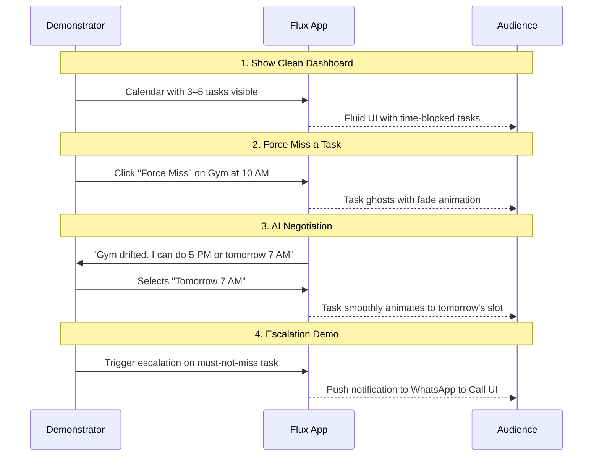

# Demo Mode

Flux includes an integrated sandbox so you can experience failure-handling flows without waiting for real time to pass.

---

## Activation

Toggle **Demo Mode** in Settings. A floating control panel appears over the normal UI.

---

## Controls

| Control | What It Does |
|---------|--------------|
| **Time Warp** | Slider to fast-forward 1–24 hours, triggering drift detection on passed tasks |
| **Force Miss** | Select any upcoming task → immediately mark as drifted → triggers ghost animation |
| **Simulate Leaving Home** | Fires context-aware reminder cascade (e.g. grocery nudge with hardcoded distance) |
| **Escalation Speed** | 1x / 5x / 10x multiplier for the push → WhatsApp → call notification ladder |
| **Reset State** | Returns to fresh demo with pre-seeded sample tasks and goals |

---

## Pre-seeded demo data

Seed script: [supabase/scripts/seed_test_data.sql](../supabase/scripts/seed_test_data.sql). Includes:

- Users (e.g. Alice as demo user for timeline)
- Goals (e.g. "Run a half marathon", "Learn Spanish basics")
- Milestones and tasks (scheduled, drifted, completed)
- Conversations and demo_flags (e.g. Bob in demo mode with virtual_now and escalation_speed)

Enough to exercise goal creation, timeline, drift, and reschedule/skip flows locally.

---

## Sample demo flow

---

See also: [Feature Flags](feature-flags.md) (`VITE_ENABLE_DEMO_MODE`).
